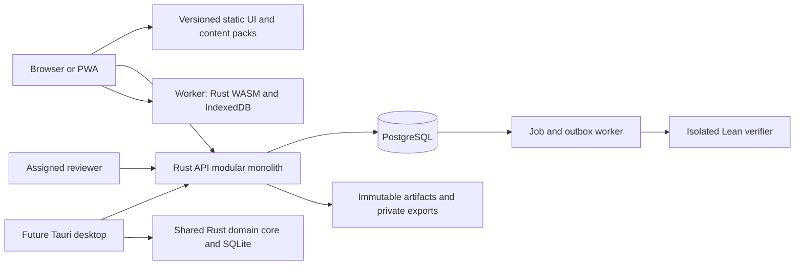

# AXIOM Mathematics Academy — Source of Truth

**Document ID:** AXIOM-SOT-001  
**Version:** 1.0.0  
**Decision date:** 9 October 2026, Africa/Nairobi  
**Status:** Authoritative project specification; implementation and learning effectiveness remain unverified.  
**Audience:** Coding agents, mathematical content authors, reviewers, designers, operators, and the project owner.  
**Canonical repository location when development begins:** `docs/AXIOM-SOURCE-OF-TRUTH.md`  
**Current deliverable:** This standalone Markdown file. No application, curriculum library, hosting account, or security control is claimed to exist merely because it is specified here.

## Contents

1. [Authority, language, and change control](#1-authority-language-and-change-control)
2. [Product mandate and honest scope](#2-product-mandate-and-honest-scope)
3. [Decisions, assumptions, and unresolved gates](#3-decisions-assumptions-and-unresolved-gates)
4. [Platform strategy](#4-platform-strategy)
5. [Learner experience and interface contract](#5-learner-experience-and-interface-contract)
6. [Curriculum model and dependency rules](#6-curriculum-model-and-dependency-rules)
7. [Foundation and secondary curriculum](#7-foundation-and-secondary-curriculum)
8. [Undergraduate pure mathematics](#8-undergraduate-pure-mathematics)
9. [Graduate pathways and research preparation](#9-graduate-pathways-and-research-preparation)
10. [Abacus and mental arithmetic](#10-abacus-and-mental-arithmetic)
11. [Pedagogy and assessment](#11-pedagogy-and-assessment)
12. [Content production and mathematical governance](#12-content-production-and-mathematical-governance)
13. [Mathematical engine and answer checking](#13-mathematical-engine-and-answer-checking)
14. [Deterministic exercise generation](#14-deterministic-exercise-generation)
15. [Proof verification and human review](#15-proof-verification-and-human-review)
16. [Adaptive mastery and review scheduling](#16-adaptive-mastery-and-review-scheduling)
17. [Rewards, progression, and motivation](#17-rewards-progression-and-motivation)
18. [Technical stack and dependency policy](#18-technical-stack-and-dependency-policy)
19. [Architecture and module boundaries](#19-architecture-and-module-boundaries)
20. [Repository structure and development workflow](#20-repository-structure-and-development-workflow)
21. [Data model and database invariants](#21-data-model-and-database-invariants)
22. [API and event contracts](#22-api-and-event-contracts)
23. [Offline operation, synchronization, and desktop parity](#23-offline-operation-synchronization-and-desktop-parity)
24. [Identity, security, privacy, and safety](#24-identity-security-privacy-and-safety)
25. [Accessibility, internationalization, and performance](#25-accessibility-internationalization-and-performance)
26. [Testing and evidence requirements](#26-testing-and-evidence-requirements)
27. [Deployment, operations, and recovery](#27-deployment-operations-and-recovery)
28. [Build phases and acceptance criteria](#28-build-phases-and-acceptance-criteria)
29. [Initial backlog and vertical slice](#29-initial-backlog-and-vertical-slice)
30. [Risk register and decision review triggers](#30-risk-register-and-decision-review-triggers)
31. [Agent handoff and definition of done](#31-agent-handoff-and-definition-of-done)
32. [Reference register and provenance](#32-reference-register-and-provenance)

## 1. Authority, language, and change control

This document governs AXIOM's intended behavior. It is a specification, not evidence that the behavior has been implemented. A future agent MUST distinguish specification, source inspection, local execution, deployed execution, manual accessibility validation, mathematical review, and learner outcome evidence.

`MUST` defines a release requirement. `SHOULD` defines a default that may be changed with a documented reason. `MAY` permits an optional feature. Numbers described as **initial policy** or **engineering target** are project choices, not established pedagogical facts or measured performance.

Authority order:

1. Direct, current instructions from the project owner, subject to applicable security and legal constraints.
2. This specification and explicitly accepted Architecture Decision Records (ADRs).
3. Versioned mathematical contracts, approved content manifests, schema definitions, and API contracts.
4. Implementation and tests, which must be corrected when they conflict with the contracts.
5. Generated drafts, design mockups, external examples, and AI suggestions.

When two authoritative artifacts disagree, create a decision issue with the exact conflict. Do not silently choose whichever is easier to implement. Correctness and data preservation take priority over cosmetic completion. A discovered mathematical defect may immediately quarantine affected exercises while its resolution is reviewed.

Every accepted change to platform, mathematics, mastery, rewards, security boundaries, or data retention needs an ADR containing: problem; decision; alternatives; rationale; migration; rollback; acceptance evidence; owner; date. Record document changes in a changelog. Use semantic document versions: patch for clarification, minor for compatible additions, major for changed learning or technical contracts. Content versions, API versions, and database migrations have independent version histories.

An agent MUST NOT infer permission to publish a public service, buy subscriptions, use real learner data in tests, or submit credentials from this document. It may implement and test locally within the task's authorized scope. Never overwrite unrelated work.

## 2. Product mandate and honest scope

AXIOM is a serious mathematics academy with a rewarding practice loop. It should take a learner from numeracy through proof-based undergraduate mathematics, into selected graduate subjects and supervised research preparation. A parallel soroban track teaches physical and virtual abacus arithmetic and, later, mental abacus practice.

The central loop is:

**Understand → predict → attempt → receive justified feedback → repair a misconception → retrieve later → demonstrate transfer → earn a meaningful milestone.**

There is no finite course that teaches all pure mathematics or guarantees research independence. AXIOM therefore has a finite common foundation, branching advanced pathways, and an expandable research frontier. Completing a pathway means meeting that pathway's published outcomes. It does not mean completing mathematics, earning a university degree, or obtaining professional accreditation.

Success means the learner can explain definitions, compute accurately where relevant, construct and critique proofs, recognize when hypotheses matter, connect subjects, retain knowledge after delays, and learn unfamiliar mathematics. Fast tapping, long streaks, video completion, and XP totals are secondary signals.

Initial audience: a self-directed adult learner, including someone restarting from arithmetic. Build respectful interfaces suitable for beginners without making an adult feel placed in a children's game. The curriculum may later serve younger learners; a public service explicitly targeting children requires the privacy, consent, safeguarding, and accessibility gates in Section 24. Do not assume the user's personal age or a launch jurisdiction.

Launch defaults:

- Free local guest practice; account creation becomes useful for backup and cross-device progress.
- English content first; internationalization is built into identifiers, presentation, and input parsing.
- Self-paced study, untimed assessments by default, optional fluency challenges.
- No advertising, loot boxes, cryptocurrency, public rankings, or pay-to-pass mechanics.
- No community messaging or public proof uploads in the initial release.
- No AI dependency for generation, grading, progression, or essential instruction.
- No subscription requirement for the learner merely to use the initial personal academy. A later commercial model is a separate owner decision.

Define product metrics before piloting: delayed success on unseen tasks; transfer success; proof rubric performance; misconception repair; voluntary return to study; task accessibility; lost-attempt rate; false positive and false negative grading incidents. Measure retention at 7 and 30 days when feasible, while recording cohort, consent, item difficulty, and attrition. Never market improvement percentages from uncontrolled anecdotes.

## 3. Decisions, assumptions, and unresolved gates

| Category | Decision or gate | Consequence |
|---|---|---|
| Chosen | Responsive web application and installable PWA first | One initial UI for mobile, tablet, and desktop |
| Chosen | React + TypeScript + Vite; Rust mathematical core and Rust API | Browser UI stays adaptable; mathematical logic has one implementation |
| Chosen | Modular monolith, PostgreSQL, separate isolated proof workers | Simple deployment with a strong boundary around untrusted proof execution |
| Chosen | Exact arithmetic and explicitly bounded symbolic checkers | No general-purpose symbolic equivalence promises |
| Chosen | Lean 4 with a pinned compatible mathlib revision for formal tasks | Formal proof results have reproducible environments and explicit trust metadata |
| Chosen | Immutable attempt evidence, versioned mastery projections, append-only reward ledger | Regrading and synchronization remain auditable |
| Chosen | Tauri 2 desktop pathway after the PWA and domain core stabilize | Desktop packaging reuses UI and domain logic |
| Assumption | Small initial team; personal/private pilot first | Avoid early microservices and institution-scale administration |
| Assumption | Network access can be intermittent and devices modest | Small content packs, local practice, explicit synchronization states |
| Initial policy | Adult-oriented public pilot unless owner selects another audience | Child-directed service remains gated |
| Gate | Hosting region, public domain, budget, and service providers | Resolve before public deployment; do not invent credentials |
| Gate | Independent mathematical reviewers and authoring capacity | Advanced content cannot be released solely by generated text |
| Gate | Content licenses and attribution ledger | Referenced books and syllabi are not permission to republish them |
| Gate | Privacy and consumer-law review for actual audience and jurisdictions | Implement approved policy before collecting public learner data |
| Gate | Package/toolchain compatibility matrix | Freeze exact tested versions in Phase 0 |
| Gate | Brand/trademark availability | AXIOM is a working product name; no legal clearance is claimed |

A gate blocks only the dependent release, not independent local implementation. For example, lack of hosting credentials does not block a local arithmetic engine or curriculum schema.

## 4. Platform strategy

### 4.1 Decision and rationale

Build a responsive website enhanced into a PWA. Mobile supports short practice, abacus interaction, and review; desktop supports substantial reading, proof writing, diagrams, and research notebooks. Tablet supports both. Learners can move between devices using the same account and curriculum identity.

PWA documentation describes installability, service workers, caching, and local data as web capabilities; actual availability differs by browser and operating system. AXIOM MUST feature-detect and test its supported combinations. See [web.dev's PWA course](https://web.dev/learn/pwa/). The platform decision and feature limits below are AXIOM design choices.

| Option | Use in AXIOM | Benefits | Costs and limits |
|---|---|---|---|
| Browser website | First release baseline | Link access, responsive layout, rapid updates | Offline and installation require enhancement |
| PWA | First product platform | Installable where supported; downloaded lessons and local practice | Storage may be evicted; background sync and install flows vary |
| Tauri desktop | Later Windows-first release, then tested macOS/Linux targets | File export, larger offline library, native Rust core | Signing, updates, webview differences, native capability security |
| Tauri mobile | Future feasibility candidate | Potential Rust/UI reuse | Requires a real prototype, plugin checks, and device/store validation |
| React Native/Expo | Alternative if demonstrated mobile needs justify a native UI | Native controls and ecosystem | UI and Rust bindings would need separate engineering |
| Separate native mobile apps now | Rejected initial strategy | Strong native integration | Splits effort before mathematics and learning loops are proven |

Do not put an arbitrary website into a wrapper and call it a validated native academy. Desktop and store releases each have explicit gates.

### 4.2 Responsive contract

Support 320 CSS pixels upward. Use content-driven layout changes near 640 and 1024 pixels rather than device-name assumptions. On compact screens, prioritize the question, input, feedback, and lesson navigation. On wide screens, permit a resizable work area with reference and proof panels. Never require a desktop viewport to access a required theorem or submit an answer.

Mobile proof writing MUST provide a plain-text fallback, symbol insertion, selectable text, and optional external-keyboard support. Long mathematical displays may scroll locally with an accessible label; the whole page MUST NOT overflow horizontally.

### 4.3 Desktop pathway

Tauri uses a Rust application core and system webviews; its IPC capability model is relevant to how frontend actions gain native access. See [Tauri architecture](https://v2.tauri.app/concept/architecture/) and [Tauri capabilities](https://v2.tauri.app/security/capabilities/).

The desktop adapter MUST use the same versioned Rust generation, checking, mastery, and reward policies as the server. Replace only storage, networking, and OS adapters. Use SQLite for desktop local projections and queued events; preserve the same logical IDs and invariants as IndexedDB. Host downloaded UI/assets locally. Disable capabilities not needed by the application; scope exports to user-selected locations. Do not grant remote pages native IPC access.

A bundled Lean process is not automatically a sandbox. Desktop formal proof execution remains online-only until an independent OS isolation design passes security review. Local ordinary mathematical checking can work offline immediately. Do not run untrusted Lean code with the learner's unrestricted filesystem access.

### 4.4 Trigger for native mobile work

Revisit native mobile only after a pilot demonstrates a required capability the PWA cannot adequately deliver: reliable large offline packs, assistive-technology compatibility, stylus workflow, notifications the learner explicitly wants, or distribution requirements. Record measured evidence and compare implementation and maintenance cost in an ADR. Notifications and store presence alone are not proof of educational value.

## 5. Learner experience and interface contract

### 5.1 Required surfaces

| Surface | Required behavior |
|---|---|
| Welcome and orientation | Explain scope, optional account, accessible input, device/offline limits, and rewards |
| Placement | Let learner choose a start or take a non-punitive diagnostic; show uncertainty and allow correction |
| Dashboard | One clear next action, due review, active pathway, recent evidence, saved/offline status |
| Curriculum atlas | Searchable list and optional graph of dependencies; explain locked recommendations; list alternative is mandatory |
| Lesson | Definitions, examples/nonexamples, interactive prediction, faded examples, exercises, reflection |
| Practice workspace | Prompt, domain, input grammar, scratchpad, hint ladder, justified feedback, report-an-issue action |
| Proof studio | Natural-language draft, structured proof tools, formal editor when supported, hypotheses, goal states, trust label |
| Abacus studio | Stable bead model, equivalent keyboard/tap controls, place values, readable state and optional physical-device mode |
| Review | Mix due concepts with enough context to answer; explain why material returned |
| Notebook | Private notes, mistakes, definitions, proof revisions, exports; autosave and conflict handling |
| Progress and rewards | Separate learned, retained, reviewed, formally checked, and human-reviewed achievements |
| Settings | Input notation, locale, timezone, reduced motion, contrast, reminders, privacy, export/delete |
| Author/reviewer console | Content lifecycle, seed previews, rubric review, defects, quarantines, audit history |

Keep advanced future courses visible as a roadmap with explicit availability labels. Do not disguise empty pages as complete courses. A graph node may be planned; only released content can be offered as a supported learning path.

### 5.2 Journeys and state handling

First visit: choose learning goals and session length; try a real lesson without an account; offer placement; save locally; explain local-storage limits; offer optional backup account. Placement gives a starting recommendation, not permanent exemptions from all later retention checks.

Returning session: display at most three priorities, such as a due fraction review, an unfinished proof, and a new lesson. A learner may explore ahead. Certified pathway completion still requires its published prerequisite and assessment evidence.

Answer submission states: editing, locally saved, submitting, queued offline, accepted, grading, feedback available, needs review, retryable failure. Preserve the input through every network or checker failure. Disable only actions that would cause ambiguity, not the whole workspace.

Feedback MUST identify an actionable mathematical issue, not merely say "wrong." Example: "You divided by x. That step requires x ≠ 0; check x = 0 separately." A parse error says what notation is accepted and preserves the original text. A checker limitation says "AXIOM cannot decide this answer with the current checker" and offers another input mode or review.

### 5.3 Visual and interaction direction

Use a calm academy/atlas identity: readable typography, restrained color, diagrams tied to the current concept, meaningful progress landmarks. Avoid a wall of competing cards. Distinguish definitions, conjectures, theorems, examples, and open problems with text labels, not color alone.

Reward feedback should be brief, optional in motion, and explain the achievement: "You solved an unfamiliar fraction comparison and explained the common denominator." Never interrupt a proof draft to demand a streak action. Preserve selection, focus, scroll position, and unfinished work when layout changes.

## 6. Curriculum model and dependency rules

The hierarchy is **pathway → course → unit → lesson → activity**, supported by a **concept/skill dependency graph**. Courses are packaging; concepts are the objects on which mastery is measured. The catalog below defines the intended coverage, not a claim that every lesson is already authored.

Each assessable skill MUST define:

- Stable ID and plain-language outcome using an observable verb.
- Mathematical objects, domain, notation, definitions, and required hypotheses.
- Hard prerequisites and recommended background, distinguished explicitly.
- Applicable dimensions: conceptual understanding, procedural skill, reasoning/proof, transfer, retention, and optional fluency.
- Examples, nonexamples, misconception IDs, exercise families, and assessment rubric.
- Required checker capability or human-review workflow.
- Source provenance, licensing, authors/reviewers, release version, and evidence of review.

A hard-prerequisite graph MUST be acyclic within a curriculum release. Use explicit skills such as `foundation.fractions.compare` and `proof.quantifiers.negate`, never position indices as identities. Relationships such as analogy, application, and "revisits" may form cycles and belong to a separate graph.

No circular teaching assumptions: computational linear algebra precedes proof-based linear algebra; introductory calculus can precede rigorous real analysis; elementary Euclidean geometry does not require differential geometry; introductory probability does not require measure theory; measure-theoretic probability does. Split a course if its units have genuinely different prerequisites.

Hard gates apply to recommended assessment readiness, not reading access. Offer a bridge lesson or challenge assessment when a prerequisite is missing. A learner can demonstrate prior knowledge; no mandatory grind through already known content.

Example concept paths:

```text
place value → integer operations → divisibility → fractions → equations → functions
fractions + geometry → ratios → trigonometry → introductory calculus
sets + functions + logic → quantifiers → proof techniques → real analysis / abstract algebra
matrix computation + proof techniques → vector spaces → linear maps → spectral theory
real analysis → metric spaces → measure theory → functional analysis / probability
groups + topology → fundamental group → covering spaces → algebraic topology
rings + fields → commutative algebra → algebraic geometry
```

The sequence is a designed dependency model. It should be reviewed against coherent university curricula without claiming institutional endorsement. Cambridge's [undergraduate course information](https://www.maths.cam.ac.uk/undergrad/node/32) and [Part III guide](https://www.maths.cam.ac.uk/postgrad/part-iii/node/83) are external scope references, not content licenses or equivalent qualifications.

## 7. Foundation and secondary curriculum

`F` means foundation, `S` secondary/pre-university bridge, `P` proof bridge. IDs below are stable course IDs. Detailed skill IDs are created during content authoring.

| ID | Course and ordered unit coverage | Prerequisites | Exit evidence |
|---|---|---|---|
| F00 | Learning to learn mathematics: notation, equality, reading a problem, estimation, diagrams, checking an answer, uncertainty | None | Explain an answer and identify whether a check actually supports it |
| F01 | Number and place value: counting, zero, ordering, decimal notation, number line, decomposition | None | Represent and compare numbers in multiple forms |
| F02 | Whole-number arithmetic: meanings of four operations, properties, algorithms, inverse operations, estimation | F01 | Solve unfamiliar multi-step arithmetic and explain regrouping |
| F03 | Integers and divisibility: negative numbers, order, factors, multiples, primes, gcd/lcm, Euclidean algorithm | F02 | Use gcd/lcm appropriately and justify elementary divisibility |
| F04 | Fractions: equal parts, number-line interpretation, equivalence, comparison, operations, mixed numbers | F02; relevant F03 skills | Explain why common denominators work and transfer across representations |
| F05 | Decimals, percentages, ratios, rates, proportions, scaling | F04 | Distinguish additive from multiplicative comparison and solve new ratio contexts |
| F06 | Powers and roots: integer exponents, scientific notation, roots, rational exponents with domains | F03–F05 | Apply exponent laws with correct restrictions and reject invalid cancellations |
| F07 | Elementary geometry and measurement: length/area/volume, angles, triangles, congruence, similarity, coordinates | F02; F05 for similarity | Construct a geometric argument, state assumptions, and explain scale factors |
| F08 | Data, counting, and chance: representations, mean/median, sample spaces, simple probability, independence intuition | F04–F05 | Explain a misleading graph and enumerate a small sample space |
| S01 | Algebra I: expressions, substitution, distributivity, equations/inequalities, systems, absolute value | F03–F06 | Solve and check equations, including exceptional and extraneous cases |
| S02 | Functions: domain/codomain/range, composition, inverse conditions, graphs, piecewise functions, transformations | S01 | Interpret functions as mappings and compare formula with domain |
| S03 | Algebra II: polynomials, factoring, rational functions, quadratics, complex numbers, exponential/logarithmic functions | S01–S02; F06 | Solve equations with domain tracking and use complex arithmetic |
| S04 | Euclidean and coordinate geometry: axioms, constructions, circles, vectors in the plane, loci, elementary proofs | F07; S01 | Write a short geometric proof and identify a missing hypothesis |
| S05 | Trigonometry: unit circle, radians, identities, inverse functions, equations, triangle applications | S02–S04 | Derive an identity and state branch/range restrictions |
| S06 | Sequences and discrete reasoning: arithmetic/geometric sequences, sums, recursion, binomial theorem, counting | S01; F08 | Compare recursive and explicit descriptions; avoid double counting |
| S07 | Introductory calculus: limits conceptually, derivative, integral, fundamental theorem, applications | S02–S05 | Connect rates, areas, and functions; distinguish numerical evidence from proof |
| P01 | Sets, logic, and mathematical language: connectives, implication, quantifiers, relations, functions, equivalence | S01–S02; can be taken alongside S03 | Negate quantified statements and explain necessary/sufficient conditions |
| P02 | Proof methods: direct proof, contrapositive, contradiction, induction, cases, existence/uniqueness, counterexample | P01; F03 | Produce complete proofs and diagnose invalid proof steps |
| P03 | Mathematical writing: definitions, theorem statements, lemma use, citations, proof structure, revision | P02 | Submit a revised proof portfolio with explicit hypotheses and reviewer feedback |

Completion of this stage requires more than calculation: include explanations of fraction equivalence, equation solution sets, function domains, a divisibility induction, a geometric argument, and an unfamiliar problem integrating at least two units. Learners may study abacus alongside F01 onward; abacus proficiency MUST NOT gate algebra or proofs.

## 8. Undergraduate pure mathematics

### 8.1 Common core

| ID | Course and unit coverage | Hard background | Representative exit task |
|---|---|---|---|
| U01 | Computational linear algebra: systems, elimination, matrices, determinants, eigenvalues, geometric transformations | S01–S03 | Solve a system and explain rank, nullity, and geometry |
| U02 | Proof-based linear algebra: fields, vector spaces, bases, dimension, linear maps, duality, inner products, spectral theorem in stated settings | U01, P02 | Prove rank-nullity and distinguish real symmetric from arbitrary matrices |
| U03 | Real analysis I: ordered completeness, sequences, limits, continuity, compactness on the real line, differentiation, Riemann integration | S07, P02 | Construct epsilon arguments and prove a theorem using completeness |
| U04 | Real analysis II: series of functions, uniform convergence, interchange conditions, metric spaces, multivariable rigor | U03; U02 where used | Give a counterexample to an invalid interchange of limit and integral |
| U05 | Multivariable calculus and forms bridge: partial derivatives, inverse/implicit function intuition, integration, vector calculus, introductory differential forms | S07, U01 | Relate a local computation to a carefully stated integral theorem |
| U06 | Abstract algebra I: groups, subgroups, homomorphisms, quotients, group actions, Lagrange, isomorphism theorems | P02; U02 recommended | Build a quotient and prove it is well-defined |
| U07 | Abstract algebra II: rings, ideals, polynomial rings, domains, fields, extensions, introductory Galois theory | U06; U02 | Analyze an extension and distinguish reducibility from solvability |
| U08 | Point-set topology: topological spaces, bases, continuity, product/quotient topology, separation, compactness, connectedness | P02; U03 metric skills | Prove a compactness result and produce a non-metric example |
| U09 | Complex analysis: holomorphic functions, Cauchy theory, power/Laurent series, residues, conformal maps | U03; complex S03; selected U05 | Prove a basic holomorphic theorem and justify a contour computation |
| U10 | Elementary number theory: congruences, CRT, arithmetic functions, Diophantine equations, reciprocity introduction | F03, P02; U06 helpful | Solve a new congruence problem and explain all solutions |
| U11 | Combinatorics and graph theory: enumeration, recurrences, generating functions, graphs/trees, extremal and probabilistic introductions | S06, P02; F08 probability | Prove a counting identity by two methods and analyze a graph invariant |
| U12 | Probability foundations: random variables, expectation, distributions, conditional probability, convergence intuition | S07, F08; P02 | Explain conditioning and distinguish independence from disjointness |
| U13 | Differential equations and dynamical systems bridge: existence/uniqueness intuition, linear systems, phase portraits, stability | S07, U01; U03 for rigorous units | Explain what a numerical trajectory can and cannot establish |
| U14 | Mathematical logic and foundations I: formal languages, propositional/first-order logic, soundness/completeness introductions, sets, cardinality | P02 | Distinguish semantic truth from formal derivability |

### 8.2 Advanced undergraduate branches

| ID | Coverage | Prerequisite route | Exit evidence |
|---|---|---|---|
| U15 | Measure and integration: sigma-algebras, measures, measurable functions, Lebesgue integration, convergence theorems, product measures | U04, U08 core | Apply dominated/monotone convergence with every hypothesis checked |
| U16 | Algebraic topology I: homotopy, fundamental group, van Kampen, covering spaces, homology introduction | U06, U08 | Compute an invariant and justify its construction |
| U17 | Differential geometry I: smooth manifolds, tangent/cotangent spaces, maps, forms, integration, Stokes | U02, U04–U05, U08 | Translate coordinate calculations into an invariant statement |
| U18 | Functional analysis introduction: normed/Banach/Hilbert spaces, bounded maps, Hahn–Banach, compact operators | U02, U04, U15 relevant skills | Prove continuity of an operator and analyze completeness |
| U19 | Commutative algebra introduction: modules, localization, Noetherian rings, prime ideals, tensor products | U07, U02 | Construct a localization or tensor product and use its universal property |
| U20 | Representation theory introduction: group representations, invariant subspaces, characters of finite groups | U02, U06 | Decompose a small representation with appropriate hypotheses |
| U21 | Algebraic number theory introduction: number fields, integers, ideals, ramification introduction | U07, U10; U19 where used | Explain why elements and ideals have different factorization behavior |
| U22 | Set theory and computability: ordinal/cardinal arithmetic, choice, computability, undecidability, incompleteness introduction | U14 | State an undecidability result precisely without overgeneralizing it |
| U23 | Geometry enrichment: projective, affine, non-Euclidean and discrete geometry; axiomatic comparison | S04, U02, P02; U08 for advanced units | Compare which conclusions depend on which geometric axioms |
| U24 | Undergraduate synthesis seminar: theorem exposition, cross-field problems, formalization, oral explanation | U02–U09 selected core; P03 | Defend a proof portfolio and solve an unfamiliar multi-subject problem |

Undergraduate core completion means approved evidence across U01–U12 and U14, plus the writing portfolio. U13 is a valuable bridge, not an artificial prerequisite for every pure subject. Advanced completion is pathway-specific; it does not require every elective. Proof-oriented exit tasks require structured or human-reviewed evidence even where computational components can be checked automatically.

## 9. Graduate pathways and research preparation

Graduate study branches. Publish a core readiness diagnostic, then let a learner choose a coherent specialization and supporting courses. Do not force simultaneous completion of analysis, algebraic geometry, set theory, and every other field.

### 9.1 Graduate course catalog

| ID | Course and scope | Required preparation | Graduate-level evidence |
|---|---|---|---|
| G01 | Measure theory and real analysis: measure construction, signed measures, Radon–Nikodym, differentiation, Lp spaces | U15, U04 | Prove a convergence or representation result and analyze failed hypotheses |
| G02 | Functional analysis: weak topologies, duality, uniform boundedness, open mapping, spectral/operator theory | U18, G01 as needed | Construct operator examples and present a substantial theorem proof |
| G03 | Complex analysis and Riemann surfaces: analytic continuation, normal families, meromorphic functions, surfaces | U09, U08, U17 introductory skills | Explain local/global distinctions through a proof and example |
| G04 | Fourier and harmonic analysis: Fourier transforms, distributions, Lp estimates, introductory singular integrals | G01–G02; U09 where needed | Establish a bound and specify the function space and convergence mode |
| G05 | PDE foundations: distributions, Sobolev spaces, weak solutions, elliptic/parabolic/hyperbolic examples | G01–G02, U13, selected G04 | Distinguish weak/classical solutions and justify an energy argument |
| G06 | Graduate algebra: modules, structure theorems, field/Galois theory, multilinear algebra, categories | U07, U19, U02 | Prove a structural result through a universal property |
| G07 | Commutative algebra: localization, dimension, integral dependence, primary decomposition, homological tools | U19, G06 relevant units | Relate a local algebraic property to a geometric example |
| G08 | Homological algebra: complexes, exactness, derived functors, Ext/Tor, spectral sequences introduction | G06–G07; category foundations | Compute a derived functor and justify the resolution used |
| G09 | Algebraic geometry: affine/projective varieties, schemes, sheaves, morphisms, divisors, cohomology introduction | G07; G08 for cohomology units | Work through an explicit scheme example and an abstract argument |
| G10 | Algebraic topology: homology/cohomology, exact sequences, CW complexes, fibrations, spectral sequences | U16, G06; G08 relevant units | Compute an invariant with a complete chain-level justification |
| G11 | Differential topology: transversality, degree, Morse theory, bundles, cobordism introduction | U17, U16 relevant skills | Explain a genericity argument with precise smoothness assumptions |
| G12 | Riemannian geometry: connections, curvature, geodesics, comparison and global theorems | U17, G11 relevant units | Derive a coordinate formula and present its invariant interpretation |
| G13 | Lie groups and representation theory: Lie algebras, exponential map, compact groups, highest-weight introduction | U20, U17, G06 | Connect algebraic representation data to geometric group structure |
| G14 | Algebraic number theory: local/global fields, valuations, ideals, units, class groups, local extensions | U21, G07 | Analyze arithmetic using local and global methods |
| G15 | Analytic number theory: Dirichlet series, zeta/L-functions, prime distribution, sieve/introduction to modular forms | U10, U09, G04 selected units | Derive an estimate and identify analytic-continuation assumptions |
| G16 | Arithmetic geometry introduction: elliptic curves, arithmetic of schemes, modular connections | G09, G14; G15 selected units | Reproduce a standard curve computation and explain its limitations |
| G17 | Extremal/probabilistic combinatorics: graph bounds, random constructions, concentration, additive methods | U11, U12; G18 for measure-based units | Present a rigorous existence argument and a sharpness example |
| G18 | Measure-theoretic probability: conditional expectation, martingales, convergence, stochastic processes introduction | G01, U12 | Prove a probabilistic result with the correct sigma-algebras |
| G19 | Mathematical logic: model theory, proof theory, computability, set theory as separate selectable strands | U14, U22 | State and prove a selected metatheorem under its formal assumptions |
| G20 | Category theory: functors, natural transformations, limits, adjunctions, Yoneda; advanced categorical methods | G06 or U08/U16 with proof maturity | Use an adjunction or universal property in a concrete subject |
| G21 | Dynamical systems and ergodic theory: invariant measures, ergodic theorems, symbolic dynamics | U13, G01, U08 | Distinguish topological, measurable, and numerical claims |
| G22 | Graduate topics seminars | Published prerequisite skills for each topic | Read, reproduce, critique, and present a specialist paper or chapter |

### 9.2 Coherent specialization pathways

| Pathway | Core route | Supporting options | Capstone |
|---|---|---|---|
| Analysis | U15/U18 → G01/G02 → G04/G05 | G03, G18, G21 | Explain a theorem, reconstruct key estimates, identify a hypothesis counterexample |
| Algebra/geometry | U19 → G06/G07 → G08/G09 | G20, G13, G14 | Develop an explicit example alongside a structural proof |
| Geometry/topology | U16/U17 → G10/G11/G12 | G13, G20, G08 | Compute an invariant and defend a geometric construction |
| Number theory | U10/U21 → G14/G15 → selected G16 | G07/G09, G04 | Compare algebraic and analytic approaches to a focused arithmetic problem |
| Logic/foundations | U14/U22 → selected G19 | G20, formal proof track | Explain a metatheorem, formalize a small result, distinguish object/meta-language |
| Combinatorics | U11/U12 → G17 | G18, G13, G15 selected topics | Give a new-to-the-learner construction or bound with a proof and limitations |
| Probability/dynamics | U15/U13 → G01/G18/G21 | G02, G04 | Prove convergence or invariance and explain the underlying measurable structure |

These routes are AXIOM-designed learning pathways. Graduate depth is benchmarked against current official course scopes, for example [Cambridge's Part III course guide](https://www.maths.cam.ac.uk/postgrad/part-iii/node/83), while the sequence and acceptance tasks are original project choices. Do not claim equivalence to a particular university's qualifying examination.

### 9.3 Research preparation, not a guaranteed research endpoint

| ID | Research skill | Required output |
|---|---|---|
| R01 | Literature search and source evaluation | Annotated bibliography distinguishing textbooks, published papers, preprints, surveys, and corrections |
| R02 | Reading a mathematical paper | Dependency map of definitions/lemmas; reconstructed proof of a central step; list of gaps in understanding |
| R03 | Reproduction and formalization | Checked reproduction of a known result or computation; environment and assumptions recorded |
| R04 | Problem formation | Precise bounded question, examples/nonexamples, relationship to known results, and a mentor-reviewed scope |
| R05 | Experimental mathematics | Reproducible computational notebook; explicit separation of observations, conjectures, and proofs |
| R06 | Seminar and writing | Expository article, oral presentation, questions addressed, revised proof portfolio |
| R07 | Supervised exploratory project | Research log, failed approaches, partial results, uncertainty, and supervisor feedback |

Research readiness requires independent expert review. Human supervision is a service with real staffing needs; do not simulate it with an AI persona. Until reviewers exist, provide self-study rubrics and label outputs self-assessed. Open problems MUST be labeled open with a source and review date; an apparent solution enters expert review and receives no "new theorem" badge from an automated text evaluator.

## 10. Abacus and mental arithmetic

### 10.1 Instrument and scope

Teach the modern Japanese soroban first. The League of Japan Abacus Associations describes the instrument as decimal, with one upper and four lower beads per rod; its described standard physical instrument has 23 rods. See [the association's soroban introduction](https://www.shuzan.jp/english/). AXIOM's compact virtual practice instrument may show fewer rods, clearly labeled as a teaching view.

An upper bead contributes five units of its rod; each engaged lower bead contributes one. Only beads touching the reckoning bar count. Represent logical engagement, not pixel coordinates. A rod has exactly ten valid digit states. Do not implement the device as five unrelated binary beads that allow gaps among engaged lower beads.

Canonical state, listed from highest place on the left to lowest on the right:

```json
{
  "schema_version": 1,
  "rod_count": 5,
  "rightmost_exponent": 0,
  "sign": 1,
  "rods": [
    {"upper": false, "lower": 0},
    {"upper": false, "lower": 0},
    {"upper": false, "lower": 0},
    {"upper": false, "lower": 1},
    {"upper": true, "lower": 0}
  ]
}
```

This represents 15. For rod index `i` in `0..n-1`, define `digit_i = 5*upper_i + lower_i`, `exponent_i = rightmost_exponent + n - 1 - i`, and `value = sign * Σ digit_i * 10^exponent_i`. Compute exactly, using rational arithmetic when exponents are negative. Constraints: `upper ∈ {false,true}`, `lower ∈ {0,1,2,3,4}`, `sign ∈ {-1,+1}`, no negative zero, bounded rod count. The sign is an explicit AXIOM teaching extension, not a bead representing a negative digit.

`rightmost_exponent = -2` makes the rightmost rod hundredths. Mark the units rod visibly and verbally. Radix position is fixed for an activity; moving it is a distinct lesson action. Overflow beyond the largest rod MUST produce an explicit "more rods needed" state, never silent truncation.

### 10.2 Curriculum sequence

| ID | Unit | Skills and assessment |
|---|---|---|
| A01 | Orientation, reset, posture, place value | Set/read 0–9, then multi-digit values; explain engaged beads; physical-device conventions reviewed by an instructor |
| A02 | Direct addition and subtraction | Operate where available beads suffice; identify digit changes and inverse operations |
| A03 | Five-complements | Use pairs summing to five; explain an addition/subtraction that requires changing upper/lower engagement |
| A04 | Ten-complements and carry/borrow | Use pairs summing to ten; carry and borrow across rods; explain the numerical invariant |
| A05 | Combined complements and multi-digit arithmetic | Mixed five/ten complements, cascading carries, zeros, multi-step sequences |
| A06 | Multiplication | Single-digit then multi-digit procedures, operand/result layout, place-value tracking |
| A07 | Division | Quotient placement, remainder interpretation, single then multi-digit divisors, checking by multiplication |
| A08 | Decimals and percentages | Fixed radix positions, exact finite decimal operations, proportional reasoning |
| A09 | Mental abacus/anzan introduction | Visualize short bead states after physical/virtual competence; fade visual support gradually |
| A10 | Fluency and mixed practice | Accuracy-first challenges, optional timing, delayed recall, error recovery |
| A11 | Optional advanced techniques | Roots or specialized methods only with instructor-authored procedures and prerequisites |

Every unit needs conceptual explanation plus practice. Do not infer finger technique from animation alone. Teach common physical conventions with instructor review; allow accessibility adaptations and handedness settings without changing numerical correctness.

For `8 + 7`, one valid ten-complement explanation is `8 + 10 - 3 = 15`: add one ten, then subtract three units from eight. In the ones rod, 8 is upper engaged plus three lower beads; removing three lower beads leaves 5. The tens rod becomes 1. Show both bead changes and their arithmetic meaning. A different valid sequence MUST NOT be rejected merely for differing from the animation.

### 10.3 Interaction and grading

Provide tap controls, keyboard rod navigation, explicit upper/lower controls, and a text/numeric equivalent for each required activity. Dragging is optional. Announce a compact state such as "Tens: 1. Ones: 5. Value: 15." Avoid announcing every animation frame.

State-transition events include: event ID; previous-state hash; action; resulting-state hash; logical step index. Use the same Rust transition reducer in the browser and server. A trajectory check verifies legal transitions and mathematical invariants; final-value checks are separate. Count minimal moves only in optional optimization challenges, never as universal arithmetic correctness.

Store an explicit task mode: `virtual_trace`, `physical_self_report`, `mental_answer`, or `numeric_equivalent`. A correct numeric equivalent can demonstrate arithmetic knowledge but cannot attest to physical finger technique or observed bead manipulation. A physical-device self-report is labeled self-reported. Camera recognition is optional future research; it requires consent, privacy design, hardware tests, and a validation dataset.

Mental abacus is an optional practiced technique. Do not promise that it raises general intelligence or replaces conceptual mathematics. Never gate university mathematics on abacus speed. Pathway rewards acknowledge demonstrated abacus outcomes separately from algebra/proof outcomes.

## 11. Pedagogy and assessment

### 11.1 Instructional design

Use spaced retrieval, explanatory questions, worked examples alternated with practice, and linked concrete/abstract representations. These principles are supported by the [IES practice guide on organizing instruction and study](https://ies.ed.gov/ncee/wwc/PracticeGuide/1). The lesson structure and numerical policies below are AXIOM design hypotheses requiring evaluation; the guide does not establish AXIOM's exact thresholds or schedule.

A lesson SHOULD contain:

1. An intelligible question or puzzle that gives the concept a purpose.
2. A prediction before explanation, with permission to be uncertain.
3. A definition with its domain and boundary cases.
4. A diagram or concrete representation with an equivalent verbal description.
5. A worked example explaining the reason for each consequential step.
6. A completion problem with some support removed.
7. Independent examples plus a nonexample or misconception challenge.
8. An explanation/proof/transfer task appropriate to the stage.
9. A short retrieval prompt and reflection on the strategy used.
10. Future review scheduled after a delay.

Early lessons may take 10–20 minutes; substantial proof lessons may take much longer. These are planning assumptions, not mandatory timers. Advanced reading needs uninterrupted time and saved drafts. Use history and cross-field links where they illuminate the mathematics; historical stories must have sources and avoid invented quotations.

Example fraction lesson: predict whether `3/4` or `5/8` is larger; align both on a number line; explain equal partitions; convert `3/4` to `6/8`; compare; ask why unequal denominators cannot be compared by numerators alone; solve an unfamiliar pair; revisit several days later with a diagram-free task. Memorizing one worked pair is insufficient evidence.

Example proof lesson: conjecture that odd + odd is even; test examples; define odd integers; write `a=2m+1`, `b=2n+1`; derive `a+b=2(m+n+1)`; explain why `m+n+1` is an integer; critique a proof that only tests three sums. A finite collection of examples is evidence for a conjecture, not a proof of a universal statement.

### 11.2 Hint and repair policy

Hints form a reviewed ladder: clarify notation → recall relevant definition → identify representation/strategy → suggest a subgoal → show a partial step → reveal the solution. Record highest hint level and whether a solution was viewed. Essential accessibility support, input help, and screen-reader use are not mathematical hints.

After a misconception, provide a targeted contrast or prerequisite repair task. Do not keep repeating the identical template. Allow the learner to inspect a complete solution after an honest attempt; reduce only the relevant independent-evidence credit, never shame the learner.

Record revisions. A first unsuccessful attempt followed by a successful repair demonstrates learning, but does not become an unassisted first-attempt success. Give repair recognition separately.

### 11.3 Assessment types and rubrics

| Assessment | Purpose | Evidence rule |
|---|---|---|
| Placement | Recommend starting point | Short, adaptive, uncertain; confirm on subsequent independent tasks |
| Guided practice | Learn with assistance | Rich feedback; does not independently satisfy mastery gates |
| Independent check | Test a defined skill | New instance; controlled feedback; score relevant dimensions |
| Retention check | Test after delay | No immediately preceding example of the same solution |
| Transfer check | Use concept in unfamiliar representation/context | Different family or representation; rubric identifies what transfers |
| Proof portfolio | Show reasoning and revision | Structured/formal/human evidence with explicit label |
| Capstone/oral review | Integrate advanced material | Expert review; unavailable until staffed |

For a proof rubric, score each dimension 0–4: statement/hypotheses; logical validity; justification of steps; completeness; clarity/notation. A proof with a substantive logical gap cannot pass because its prose is polished. Require logical validity and completeness at least 3/4, all other dimensions at least 2/4, and any course-specific critical conditions. These are initial rubric thresholds, to be reviewed with experts.

Permit alternate correct strategies and equivalent notation. A timed fluency score MUST NOT replace conceptual or proof evidence. Assessment accommodations change presentation or time conditions while preserving the intended mathematical construct; record only necessary accommodation metadata with restricted access.

## 12. Content production and mathematical governance

### 12.1 Content lifecycle

Content moves through `draft → mathematical_review → pedagogical_review → accessibility_review → release_candidate → published`. It may become `quarantined`, `deprecated`, or `archived`. Only immutable published versions can be served as official assessment content. A draft is visibly marked and cannot award official mastery.

Published lessons MUST be authored or checked by a qualified mathematical reviewer independent of the generating agent. The owner may initially fill editorial roles, but self-reviewed pilot content must be labeled as such. A public course claiming expert review requires actual review records.

Review each theorem's statement, domains, quantifiers, proof, examples, edge cases, prerequisites, and mapping to any formal version. Check both correct and plausible incorrect solutions. An item can be mathematically correct yet unfair because it assumes an untaught theorem; pedagogy review catches that failure.

### 12.2 Authoring format and artifact contract

Store validated YAML/JSON metadata and Markdown lesson blocks in Git. Do not execute arbitrary MDX or JavaScript from content. Compile approved blocks into a typed content AST: paragraph, heading, definition, theorem, proof, worked example, exercise reference, figure, table, reflection, accessible interaction. Inline mathematics is parsed/rendered separately.

Minimum manifest fields:

```yaml
schema_version: 1
id: foundation.fractions.compare.lesson
version: 1.0.0
locale: en
status: published
course_id: F04
unit_id: foundation.fractions.compare
outcomes:
  - Compare positive rational numbers using equivalent fractions.
skill_ids:
  - foundation.fractions.compare
prerequisites:
  required: [foundation.fractions.equivalence]
  recommended: [foundation.numberline.order]
exercise_refs:
  - template_id: fractions.compare.positive
    template_version: 1.0.0
    difficulty_band: 1
assessment_dimensions: [conceptual, procedural, transfer]
content_file: lesson.en.md
license_id: axiom-original-content
source_refs: []
review_record_ids: [review-math-001, review-pedagogy-001, review-a11y-001]
```

The identifiers are illustrative; named review records above are examples, not existing reviews. A release validator MUST resolve every reference and reject missing records, cycles, duplicate IDs, incompatible checker versions, and missing text alternatives. Compile a manifest hash and preserve all artifacts required to replay old attempts.

Translations use the same semantic IDs and separate locale versions. A mathematical notation change still receives mathematics review. Authoring tools must preview both visual and accessible output, including narrow screens and offline packs.

### 12.3 Defect handling and rights

A report includes content/version, exercise replay identity, learner's private attempt if consented, expected issue, and reviewer decision. A confirmed defect triggers quarantine, corrected version, impact query, regrade plan, and user-facing explanation when prior outcomes were affected. Do not edit historical feedback invisibly.

Record source URL, author, title, access date, license, permission scope, attribution, modifications, and expiry where applicable. Open access does not automatically mean freely reusable. Link to books and external courses where copying rights are absent. Original content can cite sources without reproducing their exercises wholesale. Treat AI output as a draft with provenance and mathematical review, never as evidence of licensing clearance.

## 13. Mathematical engine and answer checking

### 13.1 Core boundary

The Rust `axiom-math` crate owns parsing, mathematical ASTs, exact values, domain predicates, exercise generation, checking, and abacus transitions. It MUST NOT depend on HTTP, database access, the browser DOM, system clock, network, locale-global state, or ambient randomness. Runtime adapters pass explicit inputs. Mathematical truth MUST NOT be computed independently in React.

Exact value types: arbitrary-precision integers; normalized rationals `(numerator, denominator)` with positive denominator and gcd 1; rational complex pairs; finite sets with canonical ordering; matrices over explicit fields; intervals with endpoint inclusion and domain; polynomials over declared coefficient rings. Add algebraic numbers and advanced symbolic classes only when their representations and algorithms are independently reviewed.

Core interface shape, expressed as contracts rather than already implemented types:

```rust
pub fn parse_answer(
    raw: &str,
    grammar: &GrammarSpec,
    budget: &MathBudget,
) -> Result<AnswerAst, ParseFailure>;

pub fn generate(
    template: &ReviewedTemplate,
    identity: &ReplayIdentity,
    budget: &MathBudget,
) -> Result<ProblemArtifact, GenerationFailure>;

pub fn check(
    problem: &ProblemArtifact,
    answer: &AnswerAst,
    assumptions: &DomainAssumptions,
    budget: &MathBudget,
) -> GradeOutcome;

pub fn apply_abacus_action(
    state: &AbacusState,
    action: &AbacusAction,
) -> Result<AbacusState, TransitionFailure>;
```

`GradeOutcome` carries the dispositions in Section 13.4, including resource-limited inconclusive outcomes. `GenerationFailure` is a generation/configuration failure, never a learner failure. The API reparses raw input and validates any supplied typed representation; a client-provided AST is not trusted merely because its schema is valid. Versioned WASM bindings expose serialized DTOs, not internal memory layouts or unrestricted Rust APIs.

Decimal strings are parsed exactly when representing finite decimals. Approximate numerical activities explicitly specify tolerances, rounding, units if applicable, and reference precision. Floating point is permitted for drawing and exploratory approximations, not foundational exact correctness.

### 13.2 Input grammar

Ship a versioned grammar, examples, and structured input alternatives. Support integers, finite decimals, fractions, parentheses, permitted variables, powers, and whitelisted functions for each activity. Never evaluate learner text as JavaScript, Rust, shell, Python, or general code. Do not parse arbitrary LaTeX as executable mathematics.

Reject ambiguous expressions such as `1/2x` with a clarification request unless the activity explicitly defines that syntax. Offer `1/(2*x)` and `(1/2)*x` examples. Map accepted Unicode minus and multiplication symbols through a documented normalization stage. Decimal-comma locales require deliberate separators; do not confuse a decimal comma with a tuple separator. Preserve raw input and normalized AST separately.

Initial resource budgets: raw scalar expression ≤ 8 KiB, AST ≤ 1,000 nodes, depth ≤ 64, ordinary integer magnitude ≤ 4,096 bits, matrix size ≤ 20×20. Template-specific budgets may be smaller. Bound exponentiation before allocating giant integers. A budget failure is an unsupported input result, not a mathematical incorrect result.

### 13.3 Checker registry

Each checker declares capability ID/version, accepted answer AST, domain assumptions, algorithm, resource limits, success/failure semantics, and test corpus.

| Capability | Correctness method | Limits |
|---|---|---|
| Integer/rational answer | Normalize exact value and compare | No approximate substitution |
| Polynomial expression over Q | Normalize coefficients by monomial in fixed variable order | Degree/term limits; no unsupported functions |
| Rational expression | Compare exact cross-products plus domain conditions and task's equivalence definition | Equality where both defined differs from equality of functions with domains |
| Finite solution set | Canonicalize elements; compare full set; validate original equations | No credit for one root when all roots required |
| Interval/inequality answer | Normalize supported intervals and boundary inclusion | Domain and excluded points required |
| Matrix/vector answer | Exact entry comparison or explicitly defined equivalence, such as row space | Equivalent bases may be valid where rubric permits |
| Numeric approximation | Declared `abs_error ≤ atol + rtol*abs(reference)` | Reference must be trustworthy; NaN/Infinity rejected unless explicitly part of task |
| Abacus state/trajectory | State reducer, final exact value, required invariants | Physical technique cannot be inferred from a typed result |
| Structured algebra step | Rule checker with preconditions and retained solution set | Squaring/dividing may need case splits or final validation |
| Selected proof | Structured proof kernel or isolated Lean | Limited to supported formal task formats |
| Natural-language proof | Human rubric review | AI may suggest feedback but cannot certify it |

Numerical sampling MAY find a counterexample; it MUST NOT certify universal symbolic equivalence. A CAS, if introduced, is a bounded helper or independent test oracle, not a proof authority by default.

Mandatory regression cases: `x/x` versus `1` at zero; `sqrt(x^2)` versus `x` on negative reals; dividing by an unknown expression; logarithm domains; `0^0` under an explicitly stated convention; empty sets; repeated roots; complex branches; noncommuting matrix multiplication; singular matrices; endpoint inclusion; extraneous roots from squaring. Every released exercise family selects the relevant cases.

### 13.4 Grading result contract

Return exactly one disposition: `correct`, `incorrect`, `malformed`, `unsupported`, `inconclusive`, or `pending_review`. `incorrect` requires a supported decision under the task's declared semantics. `inconclusive` means the supported method did not decide within its limits. Infrastructure failures are separate retryable job/API failures and MUST NOT masquerade as `incorrect`.

Result includes checker/version, content identity, assumptions, score components if applicable, reason code, accessible feedback, optional counterexample/certificate, evaluation duration, and evidence strength. Feedback templates are reviewed mathematical content. Do not leak assessment solutions before the assessment policy permits them.

## 14. Deterministic exercise generation

### 14.1 Replay identity

An exercise is reproducible from an immutable identity:

```text
template_id + template_version + generator_version + checker_version
content_manifest_hash + seed_hex + difficulty_band + parameter_policy_version
```

Locale and renderer version determine presentation, not mathematical parameters. Store the generated canonical problem artifact as well as its replay identity. Reproduction does not depend on today's catalog, random library behavior, system date, device architecture, or network responses. Changed algorithms require a new generator version; never regenerate an old attempt under a different one.

Seeds are 32 bytes, represented as 64 lowercase hexadecimal characters. A fixed seed is suitable for tests and private replay. Online assessment seeds are generated with an OS cryptographic random source and are not exposed until assessment policy allows it. Practice seeds can be public. A deterministic algorithm is not an anti-cheating boundary.

### 14.2 AXIOM RNG v1

Freeze this explicit project algorithm rather than depending on an unspecified library RNG:

1. Decode exactly 32 seed bytes `S`.
2. For counter `c = 0,1,...`, compute `SHA256(D || S || BE64(c))`, where `D` is the ASCII byte sequence `AXIOM-RNG-v1` followed by one zero byte.
3. Consume each 32-byte block as four consecutive unsigned 64-bit big-endian integers. Consume blocks/counters in order; never reseed per draw.
4. For a requested integer range `[a,b]` with `1 ≤ n=b-a+1 ≤ 2^64`, compute `L=2^64-(2^64 mod n)` using a wider integer type. Read `u`; reject if `u ≥ L`; otherwise return `a + (u mod n)`. When `n=2^64`, use the full draw directly. Bounds and results may require wider signed arithmetic.
5. Define list shuffling as Fisher–Yates, iterating index from last to 1 and drawing uniformly in `[0,index]`.

This is a deterministic byte-stream specification, not a claim that a homemade construction should replace standard cryptographic protocols. Use standard libraries for hashing, signing, password handling, and transport security. Add golden vectors for seed zero, maximal seed, cross-block draws, rejection cases, and shuffle order; compare native Rust, WASM, and independent reference implementations.

Independent SHA-256 reference vector for the all-zero seed and counter 0:

```text
seed_hex = 0000000000000000000000000000000000000000000000000000000000000000
block_hex = 955ce261c1f93ec7622e45849d2c4eeaa6cecc71079e1940869f63878bb8f0e5
u64 draws = 10762726119002685127, 7074668500520554218,
            12019769241329604928, 9700581556195225829
first sample in inclusive range [1,9] = 2
```

This vector was calculated independently for this specification. A future Rust implementation must reproduce it; it is not evidence that such an implementation already exists. For range `[0,9]`, a synthetic draw `18446744073709551615` must be rejected because `L = 18446744073709551610`; a subsequent draw of 7 returns 7. Inject this synthetic stream in the rejection-sampling unit test.

Hash canonical JSON artifacts using SHA-256 over UTF-8 [RFC 8785 JCS](https://www.rfc-editor.org/rfc/rfc8785). Represent arbitrary-precision numbers as canonical decimal strings. JCS does not normalize Unicode; authoring normalization, if used, occurs before artifact freezing and hashing. Reject duplicate JSON keys, non-finite numbers, and ambiguous encodings. Prefer ASCII semantic IDs and sorted mathematical collections.

### 14.3 Template contract and constraints

An exercise template contains skills, dimension tags, supported domains, parameter bounds, constraint generator, mathematical statement builder, solver/checker, reference solution, hint ladder, misconception feedback, difficulty features, resource budget, and test corpus. Instantiate from constraints, not by asking an LLM for a fresh problem in the learner session.

For a quadratic with controlled rational roots, choose exact roots and a nonzero leading coefficient, then expand. For a invertible matrix task, construct a matrix with a proven nonzero determinant rather than assuming a random matrix is invertible. Avoid accidental triviality, impossible tasks, multiple unacknowledged answers, degenerate diagrams, and untaught techniques.

Constraint search is deterministic and bounded. Default maximum 128 candidate draws per template; on exhaustion return a generation error, record the replay identity, and select another approved template. Never silently drop a constraint or substitute an unreviewed problem.

Difficulty is a vector, not just "larger numbers": digit length, number of operations, representational change, proof depth, hypothesis complexity, distractor plausibility, and transfer distance. Keep each component explicit. Pilot evidence may revise difficulty labels while preserving historical template versions.

Example template contract:

```json
{
  "template_id": "fractions.compare.positive",
  "template_version": "1.0.0",
  "generator_version": "rng-sha256-v1",
  "checker_version": "rational-order-v1",
  "skill_ids": ["foundation.fractions.compare"],
  "dimensions": ["procedural"],
  "difficulty_band": 1,
  "parameter_policy_version": "1",
  "parameters": {
    "numerator_min": "1",
    "numerator_max": "9",
    "denominator_min": "2",
    "denominator_max": "12"
  },
  "constraints": ["proper_fractions", "different_values"],
  "answer_kind": "relation",
  "allowed_answers": ["less", "equal", "greater"]
}
```

The constraints deliberately exclude equality here; equality needs another family, and a released assessment MUST not let learners infer the answer from that exclusion. Mix independently reviewed families where appropriate. Keep internal constraints and solutions out of high-integrity assessment payloads.

### 14.4 Content QA before publication

For every released template/version: independently reviewed solver; all explicit edge fixtures; generated-property tests over at least 10,000 deterministic seeds for fast arithmetic families; bounded representative corpus for expensive proofs; invalid-answer tests; constraint exhaustion tests; native/WASM byte equality; localization checks; and accessible presentation review. The seed count is an initial engineering gate, not a proof of universal correctness. Use constructive invariants, review, and formal reasoning where possible.

## 15. Proof verification and human review

### 15.1 Four evidence levels

1. **Answer checked:** A supported numerical, algebraic, or finite-object result is checked. This does not certify the learner's entire reasoning.
2. **Structured proof checked:** A restricted proof language verifies steps, scopes, assumptions, and discharge rules. It certifies only the expressible statement within that language.
3. **Formal proof checked:** Lean elaborates a fixed statement and produces a kernel-checked proof under the recorded trusted environment and allowed axioms.
4. **Human-reviewed exposition:** A qualified reviewer evaluates natural-language mathematics with the published rubric. This remains fallible expert judgment, distinguishable from formal checking.

Label achievements with these exact distinctions. An LLM suggestion is a fifth, explicitly advisory artifact, never a promotion to one of the four levels.

### 15.2 Structured proof scope

Start with propositional and first-order exercises, elementary divisibility, induction templates, and algebraic equivalence steps. Use typed statements and scoped hypothesis IDs. Rules MUST specify preconditions, conclusion, substitutions, and discharge behavior. Check variable capture, freshness for quantifier rules, witness validity, induction base and step, and exhaustive case coverage. A reordered list of sentences is not sufficient proof verification.

A proof sketch can be pedagogically useful and labeled a sketch. Unsupported mathematical steps go to review; do not accept them because they resemble a reference solution. Advanced natural-language proofs remain outside the restricted engine's capability.

### 15.3 Lean contract

Use Lean 4 with a compatible pinned mathlib commit and toolchain, not whatever version a worker downloads at runtime. [Theorem Proving in Lean](https://docs.lean-lang.org/theorem_proving_in_lean4/) explains the formal system, and the [Lean axiom reference](https://lean-lang.org/doc/reference/latest/find/?domain=Verso.Genre.Manual.section&name=axiom-declarations) identifies `sorryAx` and native-evaluation trust implications. AXIOM's additional validation and isolation requirements are project security decisions.

The author supplies a reviewed immutable theorem statement, exact imports, namespace, allowed definitions, rubric, and expected declaration name. The learner supplies only a proof term/tactic body for that fixed goal. A validated editor format helps prevent accidental command injection; parsing restrictions are not a security sandbox because elaboration and tactics may execute code.

Verification pipeline:

1. Authenticate ownership, validate size, and freeze proof submission hash and exercise identity.
2. Load an image with a pinned toolchain, trusted imports, and a read-only library cache. Never run `lake update` on learner input.
3. Insert the proof into the fixed trusted template using a syntax-aware representation; do not concatenate learner-provided imports or declarations.
4. Elaborate within an isolated short-lived process. Preserve goal/error diagnostics with sanitized paths.
5. Extract the expected declaration and compare its type with the reviewed intended statement under the recorded trusted environment. A theorem proving a different proposition fails.
6. Check the completed proof for unresolved metavariables and enumerate transitive axiom dependencies using a trusted inspector, including the equivalent of `#print axioms`.
7. Reject `sorryAx`, new user axioms, unauthorized declarations, or other dependencies outside the task's axiom policy. For the default classical policy, only `propext`, `Quot.sound`, and `Classical.choice` may be accepted if actually needed; constructive tasks have a stricter declared set. Disallow native-evaluation axioms in the default kernel-trust policy.
8. Store theorem statement hash, proof/source hash, environment/image hash, toolchain and mathlib revision, checker version, actual axiom set, and result. Retain artifacts needed to rerun the check.
9. Commit the result through the normal grading and mastery transaction, using the unique verification job identity.

Do not rely on a string search for `sorry` or on exit code alone. A trusted imported theorem could carry an unwanted axiom; inspect transitive dependencies. If using an independently implemented proof checker for stronger assurance, document its coverage and evidence; it is not assumed to exist in v1.

Treat elaboration-process stdout, diagnostic text, and learner-produced files as untrusted. They cannot directly assert a successful grade. The proof-harness ADR MUST define a trusted final verification boundary: for example, extract a bounded typed proof-term artifact and validate it in a clean verification process against the fixed environment and goal, without rerunning learner tactics or accepting an executable learner-produced module. Verify its axiom closure there and bind the resulting report to the job/statement/artifact hashes. This may use the same pinned Lean kernel; it does not require a second independently implemented kernel. If the pinned toolchain cannot support the selected safe artifact/inspection design, keep formal grading disabled until a reviewed alternative is implemented. A sandbox that protects the host but lets submitted code forge its own success report is insufficient.

Formal correctness is conditional on the kernel, approved axioms, definitions, imports, and statement faithfully representing the intended mathematics. It does not establish novelty, pedagogical understanding, or an accurate English-to-Lean translation. Humans review that translation. A learner may use a library theorem to solve a goal correctly; tasks intended to teach a particular argument need restricted lemma access or an additional explanation rubric, not a claim that automation proves understanding.

### 15.4 Proof-worker isolation

Public learner code MUST run on dedicated Linux sandbox workers under an approved isolation design, preferably a microVM or comparably hardened boundary. A plain application process or default container is insufficient evidence. No network/egress; no host credentials; no writable trusted imports; no host mount; unprivileged user; resource quotas; syscall restrictions appropriate to the runtime; short-lived scratch space; process-tree termination; image integrity checks. The API process never invokes arbitrary proof source in-process.

Initial task quotas: 64 KiB submitted proof, 1 CPU core, 1 GiB memory, 15 seconds wall time, bounded Lean heartbeats chosen in the pinned environment, 128 KiB diagnostics, and 16 MiB writable scratch. These are tuning targets, not performance guarantees. A timeout is `inconclusive` or retryable infrastructure failure as appropriate, not an incorrect proof. Queue concurrency and per-account/IP budgets protect other learners. Test fork/process abuse, filesystem access, network attempts, import escape, giant terms, compiler exploits where known, and diagnostic leakage.

### 15.5 Human review workflow

Review request states: `submitted`, `assigned`, `in_review`, `needs_revision`, `accepted`, `rejected`, `withdrawn`. Store rubric version, reviewer identity/qualification record, conflicts of interest, comments, and appeal/revision history. Two independent reviewers SHOULD evaluate advanced capstones or contested outcomes. No guaranteed turnaround is shown until staffed and measured.

Keep learner drafts private. Access is granted to assigned reviewers for the necessary period, with audit logging. An unavailable reviewer yields a transparent pending state and alternate supported activities, not a fabricated professor's approval.

## 16. Adaptive mastery and review scheduling

### 16.1 Evidence model

Track concept mastery separately for conceptual, procedural, reasoning, and transfer dimensions. Retention is demonstrated by delayed evidence; fluency is an optional separate measure. Do not collapse these into one opaque percentage or infer reasoning mastery from correct arithmetic.

Initial policy uses a deterministic, explainable evidence score. It is not a calibrated probability of knowledge. Start each assessable dimension with `α=1`, `β=1`. For an eligible independently graded evidence event, update `α += w*s`, `β += w*(1-s)`, where `s∈[0,1]` is the reviewed rubric score and `w` is the evidence weight. Display `m=α/(α+β)` only as an internal evidence index with clear UI language; do not label it "90% chance you know this."

For a binary task, `s=1` or `0`. For a proof rubric, compute the dimension score from its mapped criteria, with critical logical failures preventing pass. Use rational arithmetic for scores/weights in the deterministic reducer. Save policy version and all source event IDs.

Eligibility and weight policy v1:

| Condition | Weight in relevant dimensions |
|---|---|
| First unassisted, supported response to a new instance | 1 |
| Delayed independent check after ≥ 24 hours | 1; additionally eligible for retention evidence |
| Reviewed transfer task with new representation/family | 1 in its mapped transfer dimension |
| Hint-assisted, solution-viewed, or coached response | 0 independent mastery weight; still records practice and repair |
| Repeated attempt on the same instance | 0 additional independent weight |
| Malformed, unsupported, inconclusive, infrastructure failure | 0; do not infer failure to know mathematics |
| Physical self-report or self-assessed advanced proof | 0 for claims requiring observed/reviewed evidence |
| Untrusted offline client score | 0 until server rechecks; then practice evidence only under Section 23 |

Cap ordinary same-family evidence at 2 weighted instances per concept/dimension per UTC day. Independent human/formal capstones have separate one-time keys. Correlated templates must be assigned the same family. For compound tasks, use reviewed skill mappings and weights; do not credit all neighboring skills automatically. Repeated failure outside the daily evidence cap can still trigger supportive repair recommendations.

### 16.2 State machine and gates

States: `not_started`, `learning`, `provisional`, `secure`, `review_due`, `needs_repair`. A state is a derived projection, not a manually editable assertion.

Initial **provisional** gate per required dimension:

- Evidence index `m ≥ 0.80`.
- At least 6 eligible evidence units overall, at least 3 in each required dimension, and at least 3 distinct exercise families overall. Multi-dimensional tasks count in each dimension only according to their reviewed mapping.
- At least one explanation or structured reasoning task where appropriate to the concept.
- No unresolved critical misconception in recent supported attempts.

The `m` threshold and evidence minimum must both hold. With the stated prior, six successes give `7/8 = 0.875`; two successes give `3/4 = 0.75` and cannot pass. An earlier failure requires additional evidence rather than being erased by a streak. These examples are arithmetic checks of the policy, not educational validation.

Initial **secure** gate: provisional plus successful independent retrieval on two occasions at least 24 hours apart, one occurring at least 7 days after provisional status, and a reviewed transfer task. A concept with formal/human proof requirements must meet those specific rubrics. Graduate course completion additionally requires its portfolio/capstone; it cannot be inferred solely from this index.

Due dates move a concept to `review_due` without erasing earned achievement history. A failed delayed check produces `needs_repair`; the system recommends focused practice and a new independent check. Retain the historical milestone and current evidence status separately.

Do not make the Beta-style cumulative index the only route out of repair. For a concept that previously reached provisional/secure status, policy v1 restores provisional readiness after three successive supported unassisted checks from at least two families, within 14 days, including one check at least 24 hours after repair began, with no critical misconception. Reconfirm any failed required dimension explicitly. The cumulative index remains visible as historical evidence; restoration is an explicit separate rule. Secure status then requires the normal delayed/transfer gate again, measured from restored provisional status. Concepts that never reached provisional still use the initial gate. Historical evidence is never erased.

### 16.3 Review scheduling policy v1

Use an explicit interval ladder `[1,3,7,14,30,60,120]` days. On an eligible successful review, advance one interval step; on an incorrect supported review, reset to 1 day and recommend same-session repair; on assisted practice or undecidable outcomes, keep the step and schedule an independent retry. On success after a failure, resume from the published restored-readiness rule, not a hidden heuristic. Dates are computed from server-trusted evaluation time for synchronized accounts.

The interval ladder is an initial heuristic. Do not claim it is a universal optimum or a validated implementation of a named memory model. A later FSRS/BKT/IRT model needs an ADR, calibration data, fairness/accessibility analysis, migration, comparison against the baseline, and reproducible parameters.

Local guest scheduling uses the device clock and is labeled local. Synchronizing it never creates high-integrity retention evidence from unverifiable time. Show due days in the learner's configured IANA timezone; store UTC timestamps. Daylight-saving transitions and timezone changes must not duplicate rewards or reinterpret old evidence.

For ordinary online study, "unassisted" means no recorded in-app mathematical hints/solution exposure under the learner's declared study conditions. Server timestamps verify elapsed intervals, not absence of external help or the learner's identity at the keyboard. These are academy learning records, not proctored external credentials. Any future accredited/certified assessment needs its own approved integrity policy.

### 16.4 Next-activity selection

Allocate an initial session mix of approximately 50% due review, 30% next-ready learning, 20% repair/transfer, adapting to availability and the learner's chosen duration. This is a product default, not an optimality claim.

Deterministic selection order: unresolved prerequisite repair that blocks current goal; overdue required review; unfinished current lesson; next ready concept; transfer/enrichment. Within a bucket, sort by priority, due timestamp, then stable skill ID; use the session seed only for exercise variants. Cap repeated failure loops and offer a different representation or break. Give a human-readable selection reason and let the learner choose another activity.

The recommender MUST NOT choose a future course with missing content or unsupported checker capabilities. Exploration can show it as planned. Placement evidence starts provisional recommendations; subsequent independent attempts confirm it.

## 17. Rewards, progression, and motivation

The user receives a visible reward when they genuinely pass and progress: a brief success acknowledgement, a milestone badge or atlas landmark where appropriate, and a clear next learning step. Rewards support mathematics rather than replacing it.

Initial reward policy:

- 10 XP for the first successful supported independent check on an exercise instance, subject to a 100 XP/day ordinary-practice cap.
- 5 XP for the first server-rechecked correct offline/guest-import practice instance, under the same ordinary-practice cap; no independent-assessment claim.
- 5 XP for a completed reviewed repair sequence, at most once per concept/day.
- 50 XP plus a named badge for the first provisional concept milestone.
- 100 XP plus a retention emblem for the first secure concept milestone.
- Course/pathway milestones use named outcomes and reviewed completion rules; optional cosmetic rewards have no mathematical authority.

These values are product tuning defaults. A transaction creates each award at most once using a unique award key. Offline displays are provisional until reconciliation. A learner can practice beyond XP caps; do not block learning or conceal that rewards have limits. Show ordinary answer success even when XP is capped.

Policy v1 uses UTC calendar days for server-enforced daily XP and repair caps, consistently with the evidence-family cap. Explain the local reset time in the learner's configured timezone. Cosmetic weekly goals may use local calendar days but cannot change server award keys. Milestone awards are lifetime one-time keys and are outside the ordinary-practice daily cap. When an offline instance later appears in an online retry, the shared instance award key prevents a second award or automatic upgrade from 5 to 10 XP.

Separate: correctness feedback; practice XP; conceptual mastery; proof evidence; course completion. XP cannot buy mastery, bypass prerequisites, or certify mathematical competence. Achievement history and current retention status are different views.

Avoid streak loss, shame, random rewards, competitive pressure, paywalls around remediation, and "lives" that prevent practice after mistakes. Offer optional weekly goals and flexible routines. Reduced-motion settings remove celebratory animation; an equivalent text reward remains. No push notification without opt-in and a useful purpose.

Reward ledger entries are append-only with policy version, source event, award key, delta, reason, and timestamp. Corrections use compensating entries linked to the original award. If an AXIOM defect invalidated an assessment, preserve cosmetic recognition by default while correcting mathematical claims and offering reassessment. Abuse adjustments need an auditable reason and appeal route; do not invisibly rewrite balances.

## 18. Technical stack and dependency policy

### 18.1 Chosen stack

| Layer | Choice | Boundary and rationale |
|---|---|---|
| Learner UI | React, strict TypeScript, Vite | Static application assets; reusable responsive UI; no second math engine |
| Routing and server-state UI | React Router; TanStack Query | Explicit route states and cache invalidation; business truth remains in Rust/API |
| UI primitives | Semantic HTML, CSS variables, accessible tested primitives where useful | Small design system; avoid unnecessary component dependencies |
| Mathematical display | KaTeX with HTML + MathML output, trusted macros disabled | Fast reviewed notation; screen-reader behavior manually validated |
| Rich input | Plain-text grammar first; optional vetted math editor later | Math editor cannot become the only accessible input |
| Browser domain runtime | Rust compiled to `wasm32-unknown-unknown`, `wasm-bindgen`, Web Worker | Same exact checker/generator compiled for browser; heavy tasks off UI thread |
| API | Rust, Axum, Tokio, Tower/tower-http | HTTP, request budgets, authentication, tracing, transaction orchestration |
| Database | PostgreSQL, SQLx, explicit SQL migrations | Transactional evidence and rewards; parameterized queries |
| Exact mathematics | `num-bigint`, `num-rational`, `num-traits`, reviewed internal AST/checker code | Bounded exact computation; audited crate feature set |
| Serialization/hashing | Serde, strict JSON validation, JCS implementation, SHA-256 | Reproducible artifacts and typed boundaries |
| Jobs | PostgreSQL-backed jobs and transactional outbox | Enough for pilot; no external queue dependency until measured need |
| Proof environment | Lean 4 + pinned compatible mathlib; isolated Linux worker images | Formal system external to Rust, supervised by Rust adapter |
| Content | Versioned Markdown + YAML/JSON → typed AST and immutable manifests | Content review in Git; no arbitrary content code execution |
| PWA storage | IndexedDB via a small adapter; Cache Storage; Workbox service worker | Explicit account partitions, pack versions, safe update policy |
| Desktop | Tauri 2 + SQLite + existing Rust domain crates | Native adapters after web parity is proven |
| Authentication | Standards-based OIDC provider behind an adapter; opaque app sessions | Avoid building a complete identity provider; public launch needs provider choice |
| Testing | Rust unit/property tests; Vitest; Playwright; axe-core; formal fixtures | Test mathematics, workflow, security, and actual browsers |
| Observability | Structured tracing, OpenTelemetry-compatible instrumentation, metrics | Redacted logs; no learner proof text in routine telemetry |
| Local deployment | Container composition: web/API, PostgreSQL, worker; separate proof isolation fixture | Reproducible development without pretending development isolation is production isolation |

Axum's official documentation describes integration with Tokio and Tower; use its supported API rather than old copied examples: [Axum docs](https://docs.rs/axum/latest/axum/). Rust/WASM integration is grounded in the [wasm-bindgen guide](https://rustwasm.github.io/docs/wasm-bindgen/). KaTeX options include rendering and trust controls: [KaTeX configuration](https://katex.org/docs/options.html).

React + Vite is selected here because the product needs a portable static shell and Rust API, not because it is universally preferable to a full-stack framework. If later SEO or public content publishing needs server rendering, add static prerendering or a separately bounded content site. Do not add a second authentication and mathematics backend through a frontend framework.

### 18.2 Versions and reproducibility

Do not use "latest" in build instructions, proof images, or deployed manifests. Phase 0 resolves a mutually compatible supported set and records exact Rust toolchain, Node LTS runtime, package manager, PostgreSQL major/minor, Lean toolchain, mathlib commit, crate/npm lockfiles, base-image digests, browser test versions, and desktop targets.

Commit `rust-toolchain.toml`, `Cargo.lock`, `pnpm-lock.yaml`, `package.json` package-manager version, `lean-toolchain`, `lake-manifest.json`, and image digest manifests. Resolve production patches through reviewed updates, not permanently frozen vulnerable dependencies. Confirm supported database lifecycle with [PostgreSQL's versioning policy](https://www.postgresql.org/support/versioning/).

The documentation URLs in this file may track newer versions than the project. They are reference material, not runtime pins. Do not copy a release-candidate version shown on a documentation index as the production choice.

Use feature flags to avoid networking or native dependencies in the math crate. Require native/WASM golden parity before accepting dependency upgrades that touch parsing, generation, normalization, or scoring. Record a dependency's license and security posture. Redis, Kafka, Kubernetes, vector databases, and runtime LLM services are deliberately deferred until a concrete measured requirement exists.

## 19. Architecture and module boundaries

### 19.1 System shape



Deploy the API and ordinary job worker as separately scalable processes from the same codebase. Proof verification is a distinct trust/deployment boundary. Most domain components remain modules in one service; the diagram does not imply a microservice per feature.

### 19.2 Domain modules

| Module | Owns | Must not own |
|---|---|---|
| Identity | Principal mapping, sessions, roles, consent linkage | Mathematical grading |
| Curriculum | Concepts, dependencies, manifests, availability | Learner reward balances |
| Content | Reviewed release artifacts and pack compilation | Arbitrary runtime code |
| Exercises | Replay identity, parameter constraints, problem artifacts | HTTP authentication |
| Attempts | Raw submissions, revisions, provenance, evidence ordering | Trusting client scores |
| Grading | Supported checker dispatch and immutable results | UI animation state |
| Proofs | Job adapter, formal trust reports, human review workflows | Editing theorem statements from learner input |
| Mastery | Versioned reducers and concept projections | Mutable ad hoc percentages |
| Scheduling | Due reviews and next-activity explanations | Unvalidated opaque AI recommendations |
| Rewards | Award eligibility and append-only ledger | Conferring mathematical truth |
| Notebook | Private drafts/revisions/export | Public publication by default |
| Sync | Event ingestion, deduplication, compatibility, cursors | Client-authored authority |
| Operations | Audit, jobs, backups, quarantine, metrics | Unrestricted access to learner content |

Ports: `Clock`, `SeedSource`, `ContentRepository`, `AttemptRepository`, `GradeRepository`, `EventStore`, `ProofVerifier`, `ReviewService`, `NotificationService`, `BlobStore`, `IdentityProvider`. Pure domain functions accept snapshots and return decisions/events. Adapters perform I/O and enforce authority boundaries.

### 19.3 Online attempt flow

1. Server issues an exercise instance bound to a released manifest and learner/session. Assessment context determines which fields are visible.
2. Client saves the answer locally before transmission and assigns a stable submission UUID.
3. API validates principal, instance ownership, schema, compatibility, and idempotency. It stores the immutable submission and allocates its stream sequence.
4. Cheap grading runs within a bounded worker pool, never blocking all async request threads. Expensive/formal tasks enqueue a job and return pending.
5. A finalized grade transaction locks the learner's stream/projection rows, appends the grade event, updates mastery and review projections, adds any unique ledger awards, and writes outbox events atomically.
6. Client receives feedback, current projection revision, and reward entries. A retry returns the same logical result without an additional attempt or award.

Do not hold a database transaction open while running Lean, calling an identity provider, or doing a long calculation. Save intent, run bounded work, then commit a guarded finalization. A duplicate worker completion cannot finalize a job twice.

### 19.4 Authority boundaries

Client-generated practice artifacts and WASM feedback improve responsiveness but are untrusted evidence for synchronized accounts. The API reconstructs/rechecks them. Content signing protects integrity and publisher identity; it does not hide solutions or prove offline independence. A malicious learner can inspect downloaded solutions. Formal certification and external credentials, if ever introduced, need a separate integrity/proctoring policy and are outside the initial product promise.

## 20. Repository structure and development workflow

Recommended monorepo:

```text
axiom/
  AGENTS.md
  README.md
  Cargo.toml
  Cargo.lock
  rust-toolchain.toml
  package.json
  pnpm-lock.yaml
  apps/
    web/                 # React learner UI and PWA
    author/              # role-restricted author/reviewer UI; shared primitives
    desktop/             # Tauri adapter, added in desktop phase
  crates/
    axiom-types/         # versioned DTOs and common IDs
    axiom-math/          # pure math AST, exact values, generators/checkers, abacus
    axiom-learning/      # mastery, scheduling, rewards as pure policies
    axiom-content/       # manifest validation and content compiler
    axiom-wasm/          # narrow wasm-bindgen facade
    axiom-api/           # Axum routes and use-case orchestration
    axiom-storage/       # SQLx repositories, jobs, transactional outbox
    axiom-worker/        # job process and proof adapter
    axiom-cli/           # content validation, replay, impact/regrade tooling
  packages/
    ui/                  # semantic accessible primitives and tokens
    api-client/          # generated from reviewed OpenAPI
    content-schema/      # generated JSON Schema and author tooling
  content/
    catalog/             # courses, skills, edges, pathways
    lessons/             # Markdown and metadata
    templates/           # reviewed generator configuration
    rubrics/
    misconceptions/
    sources/             # rights and attribution ledger
  formal/
    lean-toolchain
    lakefile.lean
    lake-manifest.json
    Axiom/               # reviewed fixed statements and trusted templates
  migrations/
  tests/
    fixtures/golden/
    e2e/
    security/
    accessibility/
  infra/
    compose/
    proof-sandbox/
    deployment/
  docs/
    AXIOM-SOURCE-OF-TRUTH.md
    decisions/
    contracts/
    runbooks/
    evidence/
    handoffs/
```

Directories denote responsibilities, not permission to scaffold every future service before the first lesson works. Keep the first slice small, with clear paths for later growth.

Phase 0 MUST supply a documented one-command local bootstrap and an automated verification command. The bootstrap checks prerequisites, installs only project-approved dependencies, applies local migrations, and uses synthetic fixtures. Never seed production automatically. `.env.example` lists variable names and descriptions without secrets.

Use generated OpenAPI/JSON Schema/TypeScript types, but review semantic changes. Rust and TypeScript DTOs must not drift through manual duplication. Keep mathematical wire values as strings where exactness requires it. Formatting, lint, type checks, schema compatibility, migration checks, golden replay, and relevant integration tests run in CI.

Build features in reviewable vertical increments. Record code and content changes together where a contract changes. An agent's `AGENTS.md` should point here, require preserved data, and define the repository's actual commands after setup; it must not claim nonexistent tools or test results.

## 21. Data model and database invariants

### 21.1 Identity and content entities

Use UUIDs for operational objects; semantic strings for stable content/concept IDs; immutable version strings and hashes for released artifacts. Never use a user's email as a primary key. Store timestamps as PostgreSQL `timestamptz`, rendered in the learner's selected IANA timezone.

| Entity | Key fields | Invariants |
|---|---|---|
| User | UUID, status, display name, locale, timezone | Separate identity provider subject; minimal profile |
| External identity | Provider issuer + subject, user UUID | Unique issuer/subject; verified account linking only |
| Session | Hashed opaque token, user, expiry, revocation | Raw bearer secret never stored in logs/database |
| Role grant | User, scope, role, granted/revoked metadata | Server-controlled; authors cannot grant themselves reviewer/admin |
| Consent/policy record | User, policy/version, decision, timestamp | Record purpose and withdrawal; legal policy chosen before public launch |
| Curriculum release | ID, manifest hash, status, timestamp | Immutable published manifest; quarantine flag separate |
| Course/pathway/concept | Semantic ID, version, release, outcomes | Resolved prerequisites, no hard dependency cycle |
| Content review | Artifact hash, reviewer, review type, decision | Required approvals resolved before publish |
| Template version | ID/version, generator/checker versions, artifact hash | Immutable executable/configuration identity |
| Exercise instance | UUID, owner, context, manifest, seed/parameters, problem hash | Bound to an owner or local guest scope; no mutable expected answer |

### 21.2 Learning and operational entities

| Entity | Key fields | Invariants |
|---|---|---|
| Attempt/submission | UUID, owner, instance, revision lineage, raw/typed answer, assistance, provenance | Immutable evidence after acceptance; no client-supplied final score |
| Grade result | UUID, attempt, ordinal, disposition, rubric components, checker policy, artifact hash | Regrade creates a new result; old result remains auditable |
| Current grade pointer | Attempt → grade result, revision | Exactly one active projection input where finalized; guarded updates |
| Learning event | Owner, monotonic sequence, event UUID/type, schema version, payload, server time | Unique sequence/event UUID per learner; append-only under ordinary operation |
| Mastery projection | Owner, concept, dimension, policy, alpha/beta, evidence counts, state, revision | Derived from event evidence; rebuildable |
| Review schedule | Owner, concept, ladder step, due time, policy/revision | Derived; server time authoritative for synchronized accounts |
| Reward entry | UUID, owner, award key, source grade/event, policy, delta, correction linkage | Unique award key; append-only; balance is sum |
| Notebook document | UUID, owner, type, title | Private by default; ownership checked on every read/write |
| Notebook revision | UUID, document, parent revision, content/hash, created time | Preserve conflicting branches; no silent last-writer-wins loss |
| Proof job | UUID, submission, environment hash, status, lease, result | Single logical finalization; source remains private |
| Human review | UUID, submission, assigned reviewer, rubric, decision/revisions | Explicit authorization and audit |
| Sync inbox | Owner, client event UUID, payload hash, ingestion status | Same ID + same payload is a retry; different payload is conflict |
| Job/outbox | UUID, type, payload, lease, attempts, next retry, dedup key | At-least-once transport; idempotent consumers |
| Audit event | Actor, action, object ID, reason, timestamp, request ID | Redacted, access-controlled, separate from learning events |
| Content defect/regrade plan | Artifact, affected versions, severity, decision, impact | Regrade is previewable and replayable |

The exact migration set must implement all required entities for its phase, with schema tests. JSONB does not replace validation or authorization. Index attempts by `(user_id, received_at, id)`, instances by owner/context, mastery by owner/concept, due reviews by owner/due time, jobs by status/next-run, and events by owner/sequence. Use keyset pagination, not unbounded history reads.

### 21.3 Representative SQL contract

This is an executable-shaped core excerpt, not the complete production migration set. Phase 0 supplies all referenced catalog tables, validation, retention constraints, indexes, and migration tests. Here, content identity is represented by immutable string/hash fields; later migrations may normalize them without losing historical identities.

```sql
CREATE TABLE users (
  id uuid PRIMARY KEY,
  status text NOT NULL CHECK (status IN ('active','disabled','deletion_pending')),
  locale text NOT NULL DEFAULT 'en',
  timezone text NOT NULL DEFAULT 'UTC',
  created_at timestamptz NOT NULL DEFAULT now()
);

CREATE TABLE learning_streams (
  user_id uuid PRIMARY KEY REFERENCES users(id),
  next_sequence bigint NOT NULL DEFAULT 1 CHECK (next_sequence > 0)
);

CREATE TABLE exercise_instances (
  id uuid PRIMARY KEY,
  user_id uuid NOT NULL REFERENCES users(id),
  template_id text NOT NULL,
  template_version text NOT NULL,
  generator_version text NOT NULL,
  checker_version text NOT NULL,
  manifest_hash text NOT NULL CHECK (manifest_hash ~ '^[0-9a-f]{64}$'),
  seed_hex text NOT NULL CHECK (seed_hex ~ '^[0-9a-f]{64}$'),
  context text NOT NULL CHECK (context IN ('practice','assessment','review')),
  problem_hash text NOT NULL CHECK (problem_hash ~ '^[0-9a-f]{64}$'),
  artifact jsonb NOT NULL,
  created_at timestamptz NOT NULL DEFAULT now(),
  UNIQUE (id, user_id)
);

CREATE TABLE attempts (
  id uuid PRIMARY KEY,
  user_id uuid NOT NULL REFERENCES users(id),
  instance_id uuid NOT NULL,
  origin text NOT NULL CHECK (origin IN ('online','offline','guest_import')),
  client_event_id uuid NOT NULL,
  submission_hash text NOT NULL CHECK (submission_hash ~ '^[0-9a-f]{64}$'),
  answer jsonb NOT NULL,
  assistance jsonb NOT NULL,
  received_at timestamptz NOT NULL DEFAULT now(),
  UNIQUE (id, user_id),
  UNIQUE (user_id, client_event_id),
  FOREIGN KEY (instance_id, user_id)
    REFERENCES exercise_instances(id, user_id)
);

CREATE TABLE grade_results (
  id uuid PRIMARY KEY,
  attempt_id uuid NOT NULL,
  user_id uuid NOT NULL,
  ordinal integer NOT NULL CHECK (ordinal > 0),
  disposition text NOT NULL CHECK (disposition IN
    ('correct','incorrect','malformed','unsupported','inconclusive','pending_review')),
  checker_version text NOT NULL,
  policy_version text NOT NULL,
  evidence jsonb NOT NULL,
  evaluated_at timestamptz NOT NULL DEFAULT now(),
  FOREIGN KEY (attempt_id, user_id) REFERENCES attempts(id, user_id),
  UNIQUE (attempt_id, ordinal),
  UNIQUE (id, attempt_id, user_id)
);

CREATE TABLE current_grades (
  attempt_id uuid PRIMARY KEY,
  user_id uuid NOT NULL,
  grade_id uuid NOT NULL,
  revision bigint NOT NULL CHECK (revision > 0),
  FOREIGN KEY (attempt_id, user_id) REFERENCES attempts(id, user_id),
  FOREIGN KEY (grade_id, attempt_id, user_id)
    REFERENCES grade_results(id, attempt_id, user_id)
);

CREATE TABLE learning_events (
  user_id uuid NOT NULL REFERENCES users(id),
  sequence bigint NOT NULL CHECK (sequence > 0),
  event_id uuid NOT NULL,
  event_type text NOT NULL,
  schema_version integer NOT NULL CHECK (schema_version > 0),
  payload jsonb NOT NULL,
  occurred_at timestamptz NOT NULL DEFAULT now(),
  PRIMARY KEY (user_id, sequence),
  UNIQUE (user_id, event_id)
);

CREATE TABLE reward_entries (
  id uuid PRIMARY KEY,
  user_id uuid NOT NULL REFERENCES users(id),
  award_key text NOT NULL,
  source_sequence bigint NOT NULL,
  policy_version text NOT NULL,
  delta integer NOT NULL,
  reason text NOT NULL,
  created_at timestamptz NOT NULL DEFAULT now(),
  UNIQUE (user_id, award_key),
  FOREIGN KEY (user_id, source_sequence)
    REFERENCES learning_events(user_id, sequence)
);
```

Foreign keys enforce some cross-user boundaries; request authorization still checks the authenticated principal. Database roles MUST prevent ordinary application updates/deletes of accepted attempts, grades, events, and rewards. Projections and current pointers are explicitly mutable. Administrative correction and legally required erasure use separate audited workflows; "append-only" does not override a legitimate data deletion policy.

### 21.4 Transaction, replay, and correction rules

Serialize learner state changes by locking that learner's `learning_streams` row, allocate sequences, and commit grade event, projections, reward entries, and outbox together. Keep lock duration short. Lock ordering is consistent across operations; retry serialization/deadlock failures with bounded jitter. PostgreSQL locking behavior is documented in [its explicit-locking reference](https://www.postgresql.org/docs/current/explicit-locking.html).

Store finalization events in server commit order. The reducer must give the same state when replaying the same ordered event stream, regardless of worker completion timing in a new replay. That claim does not mean arbitrary permutations yield the same schedule. Offline ingestion order and grading order are explicit and recorded.

Regrading: preview affected attempts; create replacement grade results; atomically update active pointers; replay affected concept projections using the selected grade for each original evidence position; append correction/audit events; issue compensating ledger entries only under the approved reward policy. Rebuilds must not generate milestone awards a second time. Include original evaluation times in replay; never use the current time for old retention evidence.

Erasure/export: preserve necessary integrity metadata only where approved policy permits it; delete or anonymize learner payloads and identifying links through a defined workflow. Backup restoration must replay deletion tombstones before serving restored data. Export includes schema version, content identities, attempts, grades, notebooks, and rewards in documented formats; secrets and unrelated users' data are excluded.

## 22. API and event contracts

### 22.1 General rules

Use versioned REST/JSON under `/api/v1`. Generate OpenAPI from Rust DTOs and review it. Authenticate before object lookup responses reveal existence. Account APIs derive user identity from the session; they do not accept an arbitrary `user_id` to choose whose work to modify. UUIDs are identifiers, not authorization.

All mutations accept a UUID `Idempotency-Key` or an equivalent stable event UUID. Scope it to principal + operation. Store request hash and logical result. Identical retries return the original result; a reused key with a changed payload returns 409. For learner evidence, persistent submission/event uniqueness outlives any short HTTP idempotency cache.

Use `application/problem+json` errors with stable machine code, request ID, safe detail, retryability, and optional field errors. Typical status codes: 400 syntax/schema; 401 session required; 403 role denied; 404 inaccessible/not found; 409 conflict/incompatible content; 413 too large; 422 unsupported mathematical input; 429 quota; 503 temporary service failure. A mathematically incorrect answer is normally a successful grading response, not an HTTP error.

Keep list endpoints bounded (default 25, maximum 100), cursor-based, and ordered. Date values are ISO 8601 UTC strings; exact mathematical quantities are canonical strings. For stale writes, use a revision/ETag and `If-Match`; preserve conflicting notebook revisions.

### 22.2 Endpoint inventory

| Method/path | Purpose | Authorization and semantics |
|---|---|---|
| `GET /health/live` | Process liveness | Minimal public response; no internals |
| `GET /health/ready` | Dependency readiness | Restricted operational detail |
| `GET /catalog/releases/{id}` | Published manifest | Public safe metadata; cache by hash |
| `GET /catalog/courses/{id}` | Course outcomes and released availability | Planned versus published explicit |
| `GET /content/packs/{hash}` | Immutable signed pack | Public or entitlement policy; never private learner records |
| `GET /auth/start`, `GET /auth/callback` | OIDC login | State, nonce, PKCE; rotate opaque app session |
| `POST /auth/logout` | Revoke session | CSRF-protected mutation |
| `GET /me` | Profile/session capabilities | Current principal only |
| `PATCH /me/preferences` | Locale, timezone, accessibility, reminders | Revision check; no role fields |
| `POST /placement/sessions` | Create placement plan | Current learner; policy/version pinned |
| `GET /learning/next` | Recommended activity and reason | Current learner; stable plan revision |
| `POST /exercise-instances` | Issue approved instance | Server validates context, prerequisites, quotas |
| `POST /attempts` | Accept submission and initiate grading | Owner-bound instance; persistent deduplication |
| `GET /attempts/{id}` | Feedback and history | Owner or explicitly authorized reviewer |
| `GET /mastery` | Dimension/state projections | Current learner; evidence links and revision |
| `GET /reviews/due` | Due review list | Current learner; configured display timezone |
| `POST /proof-jobs` | Request formal checking for accepted proof submission | Owner, quotas, fixed statement |
| `GET /proof-jobs/{id}` | Job/result status | Owner or assigned reviewer |
| `POST /human-reviews` | Request rubric review | Only if staffed feature enabled |
| `GET /rewards` | Ledger and computed balance | Current learner; pagination |
| `POST /sync/events` | Ingest queued practice/draft events | Bounded batch; per-event outcomes and deduplication |
| `GET /sync/changes?after={cursor}` | Fetch projection/content changes | Current learner; opaque server cursor |
| `POST /notebooks`, `POST /notebooks/{id}/revisions` | Private documents and revisions | Owner; conflict-preserving writes |
| `POST /exports` | Create data export | Recent reauthentication; private expiring download |
| `POST /account/deletion-requests` | Begin approved erasure workflow | Recent reauthentication; explicit UI confirmation |
| `POST /content-defects` | Report mathematical/presentation defect | Abuse-limited; private attempt linkage by consent |
| `POST /admin/content-releases` | Publish approved immutable content | Scoped publisher role and review records |
| `POST /admin/quarantines` | Disable affected content | Reviewer/admin authority; audited reason |
| `POST /admin/regrade-plans`, `POST /admin/regrade-plans/{id}/execute` | Preview then apply correction | Privileged, guarded execution; approved impact report |
| `GET /reviewer/queue`, `POST /reviewer/reviews/{id}/decisions` | Assigned human review | Assignment plus reviewer role |

Routes are a target contract. A phase must expose only implemented, tested routes and mark future ones explicitly in the generated specification. Do not return dummy success from planned endpoints. Simple polling or server-sent events can report proof status; WebSockets are unnecessary initially.

### 22.3 Representative submission/result

```json
{
  "schema_version": 1,
  "submission_id": "a2a6f8d0-74a0-4d2d-a35c-84aa4786c7e1",
  "instance_id": "5bcb8b48-ec20-4a18-a2c5-14d21f83e0b2",
  "answer": {"kind": "rational", "raw": "3/4"},
  "assistance": {"max_hint_level": 0, "solution_viewed": false},
  "client_context": {
    "app_version": "0.1.0",
    "origin": "online",
    "local_created_at": "2026-10-09T10:00:00Z"
  }
}
```

The server recomputes or validates assistance from served hint/solution events where possible. It does not claim to detect outside help. The client timestamp is diagnostic only. Example finalized response:

```json
{
  "submission_id": "a2a6f8d0-74a0-4d2d-a35c-84aa4786c7e1",
  "state": "finalized",
  "grade": {
    "disposition": "correct",
    "checker_version": "rational-equality-v1",
    "evidence_level": "answer_checked",
    "reason_code": "exact_value_match",
    "feedback": "Your fraction is equal to the required value."
  },
  "mastery_revision": 12,
  "reward_entries": [{"award_key": "instance:first-success:5bcb8b48-ec20-4a18-a2c5-14d21f83e0b2", "delta": 10}],
  "sync_cursor": "opaque-server-cursor"
}
```

IDs, timestamps, revisions, and outcomes above are illustrative fixtures. For queued formal work, return 202 with job ID and polling URL. Do not include a grade before verification finishes.

Event envelope: `event_id`, `user_stream_sequence` (server only), `schema_version`, `event_type`, `aggregate_id`, `payload`, `server_recorded_at`, `producer_version`, `source_event_id`. Types include attempt accepted, grade finalized/replaced, hint served, review scheduled, milestone reached, reward awarded/compensated, notebook revision saved, content quarantined, and account deletion requested. Client sync accepts only the allowlisted practice/draft event subset. It cannot submit `milestone_reached` or `reward_awarded` as authority.

## 23. Offline operation, synchronization, and desktop parity

### 23.1 Offline modes

| Capability | Guest/local | Account offline | Account online |
|---|---|---|---|
| Downloaded lessons and diagrams | Yes | Yes | Yes |
| Exact supported practice/abacus | Yes, local feedback | Yes, provisional feedback | Yes, server rechecked |
| Private notes and proof drafts | Yes; local export recommended | Yes, queued revisions | Yes, synchronized |
| Local practice progress and cosmetics | Local only | Provisional until accepted | Durable server record |
| Secure retention assessment | No trusted timing | No trusted timing or independence | Eligible under published policy |
| Formal Lean verification | Draft only in initial platform | Queue for later submission | Isolated server verification |
| Human review | No | Queue request | Only when staffed |

Downloaded solutions are inspectable. Consequently offline evidence can update practice history and recommend learning, but MUST NOT satisfy high-integrity assessment, delayed-retention certification, or human/formal proof claims. A server-rechecked offline correct answer can earn capped practice XP; independent online reassessment confirms provisional mastery. Product copy must make this distinction understandable without discouraging offline study.

### 23.2 Pack and service-worker policy

A content pack manifest records schema version, pack ID/version, course scope, artifact hashes/sizes, math-core compatibility, minimum app version, license/attribution, signing key ID, and signature. Verify before activation; download into staging and switch atomically only when complete. Use standard reviewed Ed25519 signing libraries or another reviewed signature scheme, never custom cryptography. Support key rotation and revocation.

Cache hashed static UI/content assets. Treat authenticated API responses as network-only unless an explicit local data adapter stores a safe projection. Never cache session endpoints, export links, private responses, or admin responses in a generic service-worker cache. Partition local learner data by account ID; clear or preserve encrypted exports according to an explicit sign-out choice. A shared device must not reveal one learner's notebook to the next.

Maintain the active session's app/core/content versions until saved work is safe. Show an update-ready action; do not force `skipWaiting` mid-answer. On update, migrate storage transactionally with rollback/export recovery. Compatibility mismatch yields a helpful update message and keeps existing drafts intact.

Browser storage can be evicted. Request persistent storage where available, display quota/download size, support selective pack removal, and explain backup/export. Default pack target ≤ 10 MiB excluding optional media; initial total downloads are opt-in. An offline badge means the chosen activity's dependencies are actually downloaded, not merely that the shell was cached.

### 23.3 Sync algorithm

1. Persist a local event UUID, payload, account partition, source pack/core identity, and local sequence before displaying "saved."
2. Upload batches of at most 100 events/1 MiB in local sequence order after authentication. Do not depend on background sync; also sync on foreground/resume and explicit action.
3. Server validates each event, ownership, version compatibility, and payload hash. A retry returns its prior receipt. A duplicate UUID with a different payload becomes a conflict requiring recovery.
4. Server reconstructs/checks mathematical practice artifacts and ignores client-reported scores, clocks, reward totals, or mastery percentages.
5. Return individual statuses: accepted, duplicate, retryable, incompatible, quarantined, or conflict, with server IDs/cursors. Do not reject unrelated valid events because one event is bad.
6. Keep local pending data until an acknowledgement is durably stored. Retry transient failures with bounded exponential backoff and jitter.
7. Fetch changes and reconcile authoritative projections; show provisional rewards becoming confirmed without replaying the celebration as a second reward.
8. Preserve incompatible/quarantined attempts as history, explain the issue, and offer reassessment; do not drop them silently.

Guest adoption is explicit: select local progress to import, recheck its artifact identities, preserve provenance as `guest_import`, and avoid merging account histories merely because display names match. Imported practice never pretends to be previously observed online assessment.

Notebook conflict policy: revisions include parent hash. If two devices edit the same parent, save both branches and show a merge UI; a CRDT may be introduced later through an ADR. Last-writer-wins is acceptable for low-impact preferences with server revision ordering, not proof drafts.

### 23.4 Desktop parity

The same signed pack, generator version, exact math AST, and policy inputs MUST produce the same canonical artifacts and feedback on native Rust, browser WASM, and Tauri. SQLite and IndexedDB implement equivalent repositories; no desktop-only shortcuts grant mastery. OS file exports require user selection and schema validation on import. Desktop updater artifacts are signed, rollback tested, and never fetched from untrusted URLs supplied by content.

## 24. Identity, security, privacy, and safety

### 24.1 Threat model

Assets: learner identity, private notes/proofs, attempt evidence, reward/mastery integrity, content release keys, staff permissions, infrastructure secrets, and availability. Adversaries include malicious learner input, compromised browsers/devices, hostile content imports, unauthorized reviewers, credential theft, automated abuse, dependency compromise, and proof-code execution.

Separate trust boundaries: browser ↔ API; API ↔ database; content publishing ↔ learner runtime; API ↔ proof sandbox; frontend ↔ Tauri native IPC; staff ↔ learner private data. Rust memory safety does not establish authorization, correct mathematics, or safe code execution.

Map requirements to the current [OWASP ASVS](https://owasp.org/projects/asvs), targeting applicable Level 2 controls for public account features, with additional proof-worker controls. Maintain a control/evidence matrix; do not claim ASVS certification from adopting the name.

### 24.2 Identity and session defaults

Use a selected reputable OIDC provider with authorization-code flow, PKCE, state/nonce validation, issuer/audience checks, and exact registered redirect URLs. The server exchanges tokens and issues an opaque random application session in a `Secure`, `HttpOnly`, appropriately scoped `SameSite` cookie. Do not store bearer credentials in localStorage or IndexedDB. Session fixation tests must pass; rotate on login and privilege change.

Protect cookie-authenticated mutations with CSRF tokens and Origin checks; SameSite alone is not the entire CSRF defense. Production frontend and `/api` SHOULD share an origin via reverse proxy, minimizing CORS complexity. If separate origins are required, use a precise allowlist, never wildcard credentialed CORS.

Local guest mode needs no login. For local integration testing, a separate fake OIDC environment may use synthetic accounts; dev-auth bypass must fail closed in production configuration. Staff publishers/reviewers/admins require MFA and least privilege, with passkeys/WebAuthn preferred where the chosen provider supports them. Recovery and account linking need verified identity, reauthentication, and audit trails. Refer to [WebAuthn documentation](https://www.w3.org/TR/webauthn-3/) when implementing the provider integration; the provider compatibility test is the release evidence.

If passwords are later hosted directly, choose an audited implementation, Argon2id parameter benchmarking, breach-resistant rate limits, reset-token expiry, and secure recovery under a dedicated ADR. Do not improvise password storage merely to avoid choosing an identity provider.

### 24.3 Application controls

- Object-level authorization on every attempt, notebook, export, review, job, and administration endpoint. Use ownership-scoped queries and cross-user tests.
- Role checks plus assignment/scope checks for reviewers; an author cannot self-approve public advanced content by changing a client field.
- Parameterized SQL; validated schema/length limits; dependency updates; safe error responses; secret management outside source control.
- Content Security Policy with narrow script/connect sources; KaTeX `trust: false`, bounded expansion, reviewed macro allowlist; sanitized content AST; no raw content HTML/scripts.
- TLS in public environments; HSTS after domain configuration is verified; encrypted database/backups through approved infrastructure; private object storage with short-lived authorized downloads.
- Rate limits for login, instance issuance, attempts, proofs, exports, defect reports, and sync; request timeouts and body caps; proof-worker isolation from Section 15.
- Redacted operational logs; tokens, answers, private proof text, and full profile data excluded by default.
- Signed release artifacts, protected publisher keys, staff audit, safe rollback, vulnerability/dependency scanning with triage.

No community feature means no initial public user-generated content moderation system. If community uploads/discussions are added, first define moderation, reporting, consent, impersonation prevention, retention, and staffing; do not silently expose private notebooks.

### 24.4 Privacy and public-launch gates

Collect only what the feature needs. Default analytics are aggregate operational/learning events without third-party advertising identifiers. Research participation is opt-in and separate from receiving instruction. No external LLM receives private learner drafts without specific informed consent and an approved data-processing policy.

Initial operational retention proposal: routine redacted request logs 14 days; security audit records 180 days; private learning history while the account is active; exports expire after 24 hours; temporary proof scratch deleted after job completion; failed-job diagnostic artifacts minimized and retained at most 7 days. These are design proposals requiring approved jurisdiction-specific policy, not legal statements. Durable proof certificates/source hashes needed for a learner's portfolio have a separate disclosed purpose and deletion policy.

Before a public release, resolve: actual audience and age policy; operating entity; jurisdictions served; hosting/processor regions; privacy notice; lawful basis/consent policy; deletion/export workflow; retention; incident response; processor agreements; accessibility obligations; and any child-specific parental-consent/safeguarding requirements. Do not invent a universal age threshold. Local private prototyping can proceed without pretending this review is completed.

Export and deletion require recent reauthentication. The UI previews what will be deleted and what policy requires retaining. Production erasure is deliberate and audited. Backup retention, restored deletion tombstones, and revoked export links are included in verification. Private saved notes remain recoverable during normal development migrations; tests use synthetic learners.

## 25. Accessibility, internationalization, and performance

### 25.1 Accessibility baseline

Target WCAG 2.2 Level AA for all released learner and staff journeys, with manual assistive-technology evidence. The [W3C WCAG 2.2 Recommendation](https://www.w3.org/TR/WCAG22/) is the standards reference. Passing an automated audit is necessary but insufficient.

Required product controls:

- Full keyboard operation, visible focus, logical tab order, focus not hidden by sticky panels, semantic buttons/inputs/headings, skip navigation, and predictable dialogs.
- Text contrast at least 4.5:1 for ordinary text and 3:1 for qualifying large text; nontext UI contrast requirements addressed. Color is never the only correctness or status signal.
- Aim for at least 44×44 CSS-pixel primary touch controls as an AXIOM usability target. WCAG 2.2 AA's target-size criterion uses a 24×24 minimum with defined exceptions; do not confuse the project target with the standard.
- Every drag interaction, including beads and graph nodes, has a non-dragging alternative. No required multi-touch gesture.
- Reflow at narrow widths and 400% zoom; selectable text; readable line lengths; local math scrolling only where needed; no clipping of input or feedback.
- Optional time challenges can be disabled. Essential assessments do not impose unnecessary timing. Support pauses and long proof-writing sessions.
- Reduced motion, no flashing celebrations, optional sound, captions/transcripts for instructional media, and written equivalents for auditory exercises.
- Clear parse-error descriptions, preserved input, consistent help, and authentication flows that do not impose unnecessary cognitive tests.

Math accessibility needs more than adding `aria-label`. Provide MathML and tested reading order, semantic text equivalents for complex notation/diagrams, accessible tables, and a plain-text input path. Avoid duplicate announcements from visual and assistive renderings. Screen-reader testing must include fractions, subscripts, matrices, quantifiers, nested expressions, goal states, proof error navigation, and abacus place values.

Required manual matrix: NVDA with a supported Windows browser; VoiceOver with Safari on macOS/iOS; keyboard-only browser use; Android TalkBack for mobile core tasks; large text/zoom; reduced motion; touch-only device. Record exact OS/browser/assistive versions. A platform is not declared supported until its core journeys pass. If a math-rendering incompatibility remains, provide a tested alternate representation and disclose the limitation.

### 25.2 Internationalization

Externalize UI strings and authored feedback. Keep semantic IDs language-independent. Support locale-aware display while exact wire mathematics uses canonical representations. Store timezone separately from language and locale. Do not infer a learner's nationality, language, or mathematical knowledge from filesystem paths or IP geolocation.

Author translations are mathematically reviewed. Decimal separator, grouping, list separator, date format, and right-to-left text need explicit input/rendering tests. Math expression direction remains appropriate to the notation inside an RTL page. Screen readers need localized speech-friendly text. Download packs contain only requested locales plus required fallback.

### 25.3 Engineering targets

Targets are provisional budgets measured on a documented mid-range mobile device/network and representative content, not claims of current performance:

| Measure | Initial target and measurement context |
|---|---|
| Core Web Vitals | p75 LCP ≤ 2.5 s, INP ≤ 200 ms, CLS ≤ 0.1 for supported production journeys |
| Initial shell | ≤ 250 KiB compressed JS before lazy mathematical/editor modules; measure actual transfer |
| First ordinary math runtime | ≤ 2 MiB compressed WASM target; if exceeded, ADR and low-bandwidth fallback |
| Core content pack | ≤ 10 MiB excluding optional media; show exact download size |
| Supported local arithmetic | p95 feedback ≤ 100 ms for normal released template bounds on target device |
| Ordinary grading API | p95 ≤ 300 ms excluding internet transit at documented pilot load |
| Abacus interaction | Input response within 100 ms; avoid sustained main-thread work and animation jank |
| Proof job | Initial 15-second execution quota; queue wait shown separately; no immediate-response promise |
| Attempt durability | Zero lost accepted attempts or duplicate awards in failure/retry acceptance suite |

Lazy-load proof editors, advanced diagrams, and optional media. Use SVG/HTML for simple math interactions; Canvas/WebGL visuals need semantic equivalents. Heavy exact calculations run in a worker; abort work on exceeded budgets. Avoid unbounded big-integer calculations or huge formula layouts.

Core Web Vitals definitions and field measurement guidance are maintained by [web.dev](https://web.dev/articles/vitals); recheck the current measurement guidance when implementing the performance gate. Load-test server behavior separately from device responsiveness.

## 26. Testing and evidence requirements

### 26.1 Testing layers

| Layer | Required evidence |
|---|---|
| Mathematical unit tests | Exact values, normalization, parser ambiguity, domains, finite sets, matrices, abacus states |
| Mathematical property tests | Rational invariants; constructive generator validity; supported transformations; legal bead transitions |
| Independent oracles | Independently calculated fixtures/reference implementations; CAS only for its declared test role |
| Determinism | Same canonical bytes/hashes for fixed identity across native Rust/WASM and later desktop |
| Proof tests | Valid proofs accepted; invalid goals/axioms/holes rejected; expected statement and trust environment checked |
| Learning-policy tests | Assistance weights, family caps, thresholds, due dates, repair, regrade replay, timezone boundaries |
| Data/integration tests | Real PostgreSQL migrations, FKs/ownership, locking, retries, outbox delivery, exactly-once award effects |
| API contracts | Schema generation, compatibility, idempotency, pagination, errors, inaccessible object behavior |
| UI component tests | Input preservation, error/help feedback, focus behavior, reduced motion |
| End-to-end browser tests | Guest lesson, account sync, review, reward, abacus, offline recovery, notebook conflict |
| Accessibility | axe-core plus required manual keyboard/screen-reader/device matrix |
| Security | ASVS mapping, cross-user access, CSRF/XSS, auth recovery, worker sandbox abuse, secret leakage |
| Operations | Backup restore, deletion tombstones, content rollback, worker restart, service-worker updates |
| Educational evaluation | Reviewed outcomes and pilot delayed/transfer evidence; separate from software tests |

Tests must challenge contracts, not merely restate the implementation. Preserve failing seeds and replay identities. A screenshot or successful build cannot prove mathematical correctness or durable data behavior.

### 26.2 Mandatory mathematical fixtures

Initial golden corpus includes at least:

- `1/2 = 2/4`; negative denominators normalize; division by zero rejected; long integers remain exact.
- `0.1 + 0.2 = 0.3` in exact finite-decimal arithmetic, independently of browser floating point.
- `x/x` domain excludes zero; `sqrt(x²)` equals `abs(x)` over the reals.
- Squaring `sqrt(x)=x-2` requires checking the original domain and rejecting extraneous candidates.
- A quadratic with repeated roots; an equation with no solution; a finite set with duplicate input values.
- Noncommuting 2×2 matrices; singular-system consistency; equivalent bases where allowed.
- Polynomial and rational-expression normalization with variable ordering and term/depth limits.
- Five-/ten-complement bead cases, carry/borrow cascades, decimal radix, reset, invalid rod states, and overflow.
- Quantifier scope/capture, invalid witness use, missing induction base, and misuse of an implication's converse.
- Lean proof using `sorry`, `admit`, injected `axiom`, wrong theorem type, unauthorized imports, or forbidden native-evaluation dependency.

For each exact checker, reviewers verify at least one alternate valid answer/strategy and multiple plausible incorrect answers. Reference solutions MUST NOT be the only accepted answer strings.

### 26.3 Realistic failure scenarios

Test a learner submitting while the network drops; duplicate submission after timeout; worker crash before/after grade commit; concurrent correct attempts; outbox redelivery; offline pack changed before sync; account switch on a shared device; local-storage eviction; stale app/core versions; timezone change; content quarantine; divergent notebook edits; delayed proof result after other grades; attempted cross-user read; export expiry; restored database containing a pending deletion.

Expected result: accepted attempts remain durable; retries are safe; input/drafts survive; official mastery uses validated evidence; rewards do not duplicate; unauthorized data does not leak; failures have recoverable UI states.

### 26.4 Evidence files and claims

For each phase, store a dated evidence report in `docs/evidence/` with commit, environment, commands/tools, fixture/content hashes, scenarios, results, failures, reviewer identities where relevant, and unverified gaps. Redact private data. Mark each result as local automated, local manual, deployed automated, deployed manual/device, mathematical review, or learner outcome study.

Do not write "production ready" because unit tests pass. Public readiness requires the deployed journey, operational recovery, accessibility, security, content review, and policy gates. Desktop readiness requires signed installer/update and actual OS tests. Educational effectiveness requires learner evidence and an appropriate study design.

## 27. Deployment, operations, and recovery

### 27.1 Environments and hosting

Maintain local, CI/test, staging, and production environments with isolated databases, identity clients, storage, signing keys, and secrets. Use synthetic learners in local/CI/staging by default. No production credentials or data copied into agent fixtures.

Initial public deployment can use a static/CDN frontend, container-hosted Rust API/ordinary worker, managed PostgreSQL with point-in-time recovery, private artifact storage, and separately isolated proof hosts. Provider/region are chosen after budget, latency, isolation, and privacy requirements are evaluated. Proof isolation is a selection requirement; a generic serverless function alone does not meet it.

Serve UI and API through a stable HTTPS origin. Apply database migrations through an explicit deployment step. Use expand/contract migrations for compatible rollout; keep old clients/content compatible for a defined window. Adopt a default 90-day replay-compatibility window for active application clients and retain historical content artifacts as long as approved attempt/portfolio records need them. Security revocation can shorten client support, while preserving export/recovery paths.

Content release and software deployment are separately versioned. A failed software deploy can roll back without rewriting content or learner evidence. A quarantined mathematical template can be disabled without deploying a new UI. Feature flags gate unready courses, human review, formal verification, desktop features, and any AI assistance; flags are server-enforced where authority matters.

### 27.2 Operations targets and telemetry

Initial pilot service target: 99.5% monthly availability for ordinary authenticated learning APIs, excluding an explicitly documented maintenance policy. This is an internal target, not a promised SLA. Proof and human-review service states are measured separately. Record API latency/errors, attempt acceptance/finalization lag, queue age, worker memory/timeouts, duplicate submissions prevented, sync incompatibilities, quarantine events, backup success, and failed authorization attempts.

Alert on lost processing progress, growing queues, elevated 5xx rates, backup failure, signature verification failure, unexpected grading-disposition changes, and mathematical defect clusters. Use aggregate metrics and hashed identifiers as needed; no private answer/proof text in metric labels. Alert thresholds are tuned from baseline measurements and saved in runbooks.

Outbox workers use leases and bounded retries. Dead-letter jobs remain visible to operators, with learner-facing pending/failure state and a safe retry action. Operators must not silently mark failed proof jobs correct to clear the queue.

### 27.3 Backup and recovery

Engineering targets: RPO ≤ 15 minutes and RTO ≤ 4 hours for account learning data at public beta. Confirm that the selected provider/configuration meets them. Use encrypted backups, access controls, database point-in-time recovery where available, independent artifact backups, and documented signing-key recovery/rotation.

Perform a real restore to an isolated environment before public launch and at least quarterly thereafter. Validate attempts, current grades, event order, reward totals, notebook revisions, content manifests, pending jobs, and deletion tombstones. Rebuild mastery projections and compare against stored snapshots. A backup-job success message is not evidence that restoration works.

During disaster recovery, protect grade/reward idempotency against job redelivery. Apply erasure tombstones before exposing restored learner data. Record actual RPO/RTO achieved. Establish a learner-facing maintenance message that preserves local drafts and explains synchronization delay.

### 27.4 Runbooks required before public beta

Runbooks: deployment/rollback; migration failure; mathematical quarantine/regrade; session/identity outage; proof queue/sandbox incident; lost/expired sync compatibility; export/deletion; backup restore; signing-key compromise; privacy/security incident; dependency vulnerability; reviewer access removal. Every runbook names a responsible role and evidence to collect, without embedding credentials.

## 28. Build phases and acceptance criteria

Advance by demonstrated outcomes, not elapsed calendar time. Estimates depend heavily on mathematical authoring and review capacity. A solo/private prototype can move quickly; graduate course production and research mentoring are sustained programs. Do not promise a complete academy in a few sprints.

### Phase 0 — Contracts and reproducible foundation

Scope: repository, ADRs, tested toolchain matrix, typed DTOs, curriculum/content schemas, exact rational/parser core, deterministic RNG, local environment, initial threat model, rights ledger, and CI.

Acceptance:

- Clean checkout boots documented local environment using synthetic data; no hidden global configuration dependency.
- Content validator detects unresolved references, hard-dependency cycles, invalid domains, missing review metadata, and unsupported checker requirements.
- Deterministic RNG and artifact hashing have independent golden vectors; native/WASM bytes match.
- Exact rational/parser fixtures pass; ambiguity/resource limits are tested.
- PostgreSQL migration applies to an empty database and upgrade fixture; ownership invariants tested.
- Source-of-truth copied into repository with changelog; owner-facing assumptions/gates recorded.

### Phase 1 — One complete learning loop

Scope: guest orientation, place value/arithmetic, an accessible lesson workspace, one fraction comparison lesson as a second representation test, abacus orientation/direct operations, local save/export, feedback and first reward. No public account launch required.

Minimum reviewed pilot content target: 12 lessons across F01/F02 and introductory A01/A02, plus 2 fraction lessons; at least 8 independently reviewed exercise families. These counts are capacity targets; quality and journey completion are acceptance gates.

Acceptance:

- A beginner can enter, study, attempt, understand feedback, repair an error, receive a reward, leave, and resume saved work.
- Exact checking accepts equivalent correct values and rejects relevant edge cases.
- Abacus rod states and carry demonstrations are numerically correct; keyboard/tap equivalents work.
- Core journey works at 320-pixel layout, with keyboard and the initial screen-reader/device checks.
- A simulated connection failure preserves an answer; guest export/import round-trips.
- No dummy progress, unsupported claims, unreviewed official content, or fake professor approvals.

### Phase 2 — Durable accounts, adaptive practice, and PWA

Scope: real identity adapter, private account data, server rechecking, mastery/review policy v1, reward ledger, signed downloadable packs, sync, notebook revisions, operational staging.

Acceptance:

- One learner uses two devices; accepted attempts, due reviews, notes, and rewards reconcile correctly.
- Duplicate submission/retry/outbox scenarios produce one logical result and one eligible award.
- Offline completed practice survives app restart and sync; client scores/clocks cannot create official mastery.
- Account switching and unauthorized cross-user requests reveal no private work.
- Seven-day retention criteria are validated with clock-controlled integration tests and then a real timed pilot observation; tests do not substitute for the pilot.
- Service-worker upgrade and storage-migration tests preserve drafts.
- Backup restore and export/delete workflow run in staging; actual gaps documented.

### Phase 3 — Foundation and proof bridge academy

Scope: F00–F08, S01–S06, P01–P03 and abacus A01–A05 to reviewed pathway depth; structured reasoning/checkers; proof notebook; curriculum atlas; misconception repair.

Acceptance:

- Every released unit has outcomes, prerequisites, independent/retention/transfer assessments, accessible alternatives, reviewed feedback, and supported checker/review status.
- A learner completes a foundation pathway through unfamiliar tasks rather than template repetition alone.
- Structured proof engine rejects invalid scopes/rules and supports at least direct elementary arguments, quantified-statement exercises, and reviewed induction tasks.
- Hard dependency graph is acyclic; challenge placement and bridge lessons work.
- Mathematical review audit passes; unresolved high-severity defects are quarantined.
- Pilot reports delayed/transfer performance and accessibility barriers with limitations, without unsupported causal claims.

### Phase 4 — Calculus, undergraduate core, and formal proof pilot

Scope: S07 and staged U01–U14; selected Lean exercises; actual human proof review where staffed; abacus A06–A10. Release courses incrementally rather than claiming the whole set at once.

Acceptance for each course:

- Complete course outcomes mapped to reviewed activities and final proof/transfer evidence.
- Computational answer checking and reasoning evidence remain separately labeled.
- Lean harness fixes expected statements, checks kernel/trust results and transitive axioms, rejects malicious/invalid fixtures, and meets approved isolation tests.
- Proof service outage leaves drafts safe and does not issue grades or milestone rewards prematurely.
- A qualified reviewer accepts a sample of independently produced learner proofs using the rubric.
- At least one complete undergraduate capstone trajectory has real review evidence before declaring undergraduate pathway completion supported.

### Phase 5 — Advanced undergraduate and graduate pathways

Scope: U15–U24 and graduate courses released by coherent specialization; research-literacy tools; advanced authoring/review operations. Prioritize one fully supported graduate route, not twenty-two empty shells.

Acceptance:

- Each advertised pathway has every required course available with reviewed material and prerequisites.
- Graduate tasks require substantive proofs, counterexamples, synthesis, and exposition; automatic arithmetic scores cannot satisfy them.
- Independent subject expert reviews course depth and capstone expectations against the chosen benchmark, with no accreditation claim.
- Human review capacity and expected turnaround are real and communicated.
- Regrade/quarantine drill proves correction of an advanced content defect without losing notebooks or duplicating rewards.

### Phase 6 — Desktop and optional native mobile

Scope: Windows Tauri app first; tested additional desktop targets; native mobile only after its ADR and prototype evidence.

Acceptance:

- Native/WASM/server golden parity holds for released mathematics and policy inputs.
- Signed install, update, rollback, uninstall, local data migration, import/export, and sync tested on actual supported OS targets.
- Tauri capability/IPC tests enforce narrow permissions; remote content cannot acquire native powers.
- Offline practice and large packs work within measured storage/resource budgets.
- No local untrusted Lean execution without separately approved sandbox evidence.
- Mobile store release, if selected, passes actual device, accessibility, permission, privacy, and store-policy review; a successful build alone is insufficient.

### Phase 7 — Research preparation and ongoing academy operation

Scope: R01–R07, specialist seminars, mentor-supervised projects, continuously maintained content and trust environments.

Acceptance:

- Learner can construct an annotated bibliography, reproduce a known result, write an expository account, and defend a bounded question.
- Experts review research-readiness portfolios; open problems are labeled and novelty claims enter review.
- Maintenance ownership exists for mathematical defects, toolchain updates, content rights, security, accessibility, backup/restore, and mentor/reviewer capacity.
- Product claims remain aligned with evidence; expanded topics receive the same release standards as the foundation.

### Cross-phase public release gates

Public launch cannot occur until approved privacy/audience policy, working production identity, reviewed released content, actual deployed end-to-end checks, applicable security controls, manual accessibility evidence, monitoring, backup restore, support/incident ownership, and verified data export/deletion are complete. Any enabled formal verification also requires production sandbox evidence. Human review and research supervision require real assigned people. Disabled future features do not block release of a genuinely complete smaller academy.

## 29. Initial backlog and vertical slice

The first implementation should prove one real lesson from content to feedback to durable reward. Avoid building an elaborate dashboard before the checker and learning evidence work.

| Priority | Work item | Concrete completion evidence |
|---|---|---|
| P0 | Freeze ADRs for platform, mathematical trust, IDs, privacy assumptions | Accepted decision records and current gates |
| P0 | Create repository/toolchain/bootstrap and CI | Clean-checkout build and verification report |
| P0 | Rational types, parser, deterministic RNG, JCS artifact hashing | Independent fixtures and native/WASM equality |
| P0 | Schema and validator for concepts/lessons/templates | Valid fixture accepted; malformed/cyclic fixture rejected |
| P0 | Author/review fraction comparison lesson and families | Mathematical/pedagogical/accessibility review records |
| P0 | Accessible lesson/input/feedback workspace | Keyboard and screen-reader journey; answer preservation |
| P0 | Guest local storage/export and one success reward | Restart and import/export demonstration |
| P1 | Abacus reducer and place-value studio | Ten states/rod, numeric invariant, keyboard/tap evidence |
| P1 | Account/session adapter and ownership-scoped attempt APIs | Two-user authorization and real provider staging login |
| P1 | Transactional grading/mastery/rewards/outbox | Duplicate/concurrency/crash recovery integration tests |
| P1 | Due-review selection and explainable dashboard | Clock-controlled policy evidence and transparent next action |
| P1 | Signed pack download/offline queue/sync | Interrupted-download and reconnect scenario |
| P1 | Private notebook revisions and conflict handling | Two-device divergent edits preserved |
| P2 | Structured proof language and fixed Lean harness | Soundness fixtures, trust validation, sandbox review |
| P2 | Content publishing/quarantine/regrade tooling | Reviewed correction preview and no duplicate awards |
| P2 | Deployed staging, accessibility/performance/restore gates | Evidence report with actual platform coverage |

Vertical slice scenario: the learner compares `3/4` and `5/8`, predicts, studies the denominator explanation, answers an independently generated comparison, gets exact feedback, makes and repairs a common-denominator error, earns the eligible reward once, closes/reopens the application, and later receives a new review task. Online version adds authenticated save, duplicate retry, second-device resume, and server-validated evidence. Offline version keeps practice explicitly provisional.

This scenario tests actual product behavior. UI-only mocks, hard-coded successful grades, and prefilled progress bars do not satisfy it.

## 30. Risk register and decision review triggers

| Risk | Mitigation | Trigger/action |
|---|---|---|
| False mathematical acceptance | Exact bounded checkers, domain contracts, independent review, negative fixtures | Quarantine family immediately; impact/regrade and notify affected learners |
| Curriculum too broad to author well | Complete one pathway at a time; label roadmap availability | Remove unsupported completion claims; prioritize reviewed depth |
| Formal system proves wrong statement | Fixed statement/hash and human translation review | Recheck mapping and affected certificates |
| Proof sandbox escape or spoofed result | Dedicated isolation, trusted result validation, security review | Disable formal jobs, revoke affected environment, investigate before reenabling |
| AI produces convincing invalid instruction | Draft-only AI; qualified review; no AI authority | Quarantine and correct; record provenance |
| Mastery model overstates learning | Multiple dimensions, delayed/transfer checks, transparent heuristic | Recalibrate with evidence; migrate policy without erasing history |
| Repetition/reward farming | Family caps, unique awards, independent gates | Tune incentives; preserve access to unlimited learning practice |
| Offline loss or drift | Staging pack activation, explicit save/sync state, exports, compatibility | Recovery UI; preserve events; reassess uncertain evidence |
| Mobile math inaccessible | Tested alternate inputs/representations and actual assistive matrix | Block affected supported journey until remedy or clear limitation |
| Private proof/notebook leakage | Ownership queries, reviewer assignments, private exports, redacted telemetry | Incident runbook and access/key revocation |
| Too few human reviewers | Clear queue/service availability; release only staffed claims | Pause advanced reviewed-completion feature, continue supported practice |
| Dependency/toolchain drift | Locks, image digests, golden corpus, reviewed updates | Compatibility branch; no uncontrolled production upgrade |
| Hosting/proof costs | Local guest mode, quotas, measured resources, budget alarms | Owner-approved capacity/provider change; no automatic paid top-up |
| Content rights failure | Source/permission ledger and original materials | Remove disputed artifacts through a versioned release; retain audit |
| Brand conflict | Working name until clearance | Owner chooses rename before public launch |
| Misleading product claims | Evidence-labeled reporting, pathway-specific outcomes | Update copy and gates before release |

Revisit architecture only when evidence justifies it: PostgreSQL queue contention; proof-worker scaling; measured mobile/native capability gap; unacceptable bundle or device performance; institutional tenancy requirements; supported collaborative editing; or calibrated adaptive modeling. Record alternatives and migration cost. Do not rewrite the stack because a new agent prefers another framework.

## 31. Agent handoff and definition of done

### 31.1 Start-of-task protocol

1. Read this document, repository `AGENTS.md`, relevant ADRs, current phase, latest handoff, content release manifest, and current evidence report.
2. Inspect actual repository state, uncommitted changes, toolchain, services, and secrets configuration without printing secrets. Do not assume prior deployment URLs or versions remain current.
3. Identify the requested outcome, affected contracts, allowed mathematical capabilities, and prerequisite release gates.
4. Choose a small vertical implementation slice and list concrete acceptance scenarios. Preserve existing assets/data; use synthetic test records.
5. Implement source, content, schemas, UI states, and recovery behavior needed for that slice. Do not use mock success where real behavior is required.
6. Run appropriate mathematical, integration, browser/manual, and security checks for the changed boundary. Reuse existing evidence unless changes invalidate it; do not repeat broad tests without reason.
7. Update contracts/docs/evidence and provide a reviewable diff plus honest result. Public deployment, purchases, publication, and real data changes follow the owner's actual authorization.

Do not ask the owner to choose routine implementation details already settled here. Ask only for missing information that materially blocks the intended outcome, while continuing independent work. A credential/provider gate is not an excuse to leave local math and UI unfinished.

### 31.2 Required handoff record

Store one concise record at `docs/handoffs/YYYY-MM-DD-task.md`:

```text
Task and owner request:
Current phase and document/ADR versions:
Repository/branch/commit and working-tree state:
What changed and why:
Content/template/checker/policy/schema versions touched:
Actual setup and verification commands:
Evidence paths and platform/environment coverage:
Known failures and unverified gaps:
Migrations/data effects and rollback:
External gates (credentials, hosting, legal, reviewer capacity):
Next concrete task and its acceptance scenario:
```

Avoid secrets and private learner content. A handoff must tell the next agent what actually exists, how to reproduce the result, and which claims are still unverified. Screenshots may accompany evidence but do not replace replay artifacts or test reports.

### 31.3 Definition of done

A feature is done only when its authorized scope works end to end, mathematical contracts are satisfied, meaningful tests/reviews pass, required UI states and accessibility alternatives are present, attempts/drafts survive relevant failures, authorization and idempotency hold, versioning/migration/rollback are addressed, and documentation/evidence match actual behavior.

A course is done only when every required outcome has published reviewed content and supported assessment evidence, delayed/transfer checks exist, prerequisites resolve, sources/rights are recorded, and the learner journey is validated. A graduate pathway is done only when all required courses and real proof-review/capstone processes are available.

The following do not establish completion: feature count; generated lesson count; successful compile; green tests that only mirror code; attractive screenshots; invented reviewers; a formal proof of a mistranslated statement; a working shell with no teaching content; a deployment without restore/security/accessibility evidence.

### 31.4 Non-negotiable project rules

- Mathematical correctness and honest evidence outrank speed and appearance.
- Rust owns shared mathematical and learning-policy logic; clients do not grant authoritative mastery or rewards.
- Published content and accepted evidence are versioned and replayable; corrections are explicit.
- Unsupported answers and infrastructure failures are not automatically wrong mathematics.
- No learner proof executes with unrestricted server or desktop privileges.
- Accessibility is part of the required product, including abacus and proof input.
- Reward genuine learning without punishing mistakes or requiring compulsive use.
- Complete supported pathways before expanding claims; research remains open-ended and expert-supervised.
- Preserve unrelated work and real learner data; make consequential operations reviewable.

## 32. Reference register and provenance

Primary sources below were consulted on 9 October 2026. They support general standards, documented platform behavior, and scope comparisons. AXIOM's architecture, schemas, thresholds, phases, and acceptance criteria are project decisions unless explicitly attributed. Recheck changing technical documentation against the pinned implementation versions. No source below endorses AXIOM or grants accreditation.

| Ref | Primary source | Use and limit |
|---|---|---|
| REF-01 | [web.dev: Learn PWA](https://web.dev/learn/pwa/) | PWA capabilities, caching, installation, local data; support still tested per browser |
| REF-02 | [Tauri: Architecture](https://v2.tauri.app/concept/architecture/) | Desktop Rust/webview architecture; not evidence of AXIOM packaging |
| REF-03 | [Tauri: Capabilities](https://v2.tauri.app/security/capabilities/) | Native IPC permission model; AXIOM still enforces and tests its own boundary |
| REF-04 | [Axum official crate documentation](https://docs.rs/axum/latest/axum/) | Rust HTTP/Tokio/Tower integration; runtime version must be pinned |
| REF-05 | [wasm-bindgen guide](https://rustwasm.github.io/docs/wasm-bindgen/) | Rust/browser binding design |
| REF-06 | [React documentation](https://react.dev/) | UI library and component model |
| REF-07 | [Vite guide](https://vite.dev/guide/) | Frontend build/runtime requirements; verify with chosen runtime |
| REF-08 | [Rust installation/toolchain guidance](https://rust-lang.org/tools/install/) | Supported toolchain setup; no exact project toolchain chosen by this artifact |
| REF-09 | [PostgreSQL explicit locking](https://www.postgresql.org/docs/current/explicit-locking.html) | Transaction/locking semantics for idempotent state changes |
| REF-10 | [PostgreSQL versioning policy](https://www.postgresql.org/support/versioning/) | Supported database lifecycle |
| REF-11 | [RFC 8785: JSON Canonicalization Scheme](https://www.rfc-editor.org/rfc/rfc8785) | Canonical JSON bytes, exact-value string representation considerations |
| REF-12 | [Theorem Proving in Lean 4](https://docs.lean-lang.org/theorem_proving_in_lean4/) | Formal proof language and foundations |
| REF-13 | [Lean reference: Axiom declarations](https://lean-lang.org/doc/reference/latest/find/?domain=Verso.Genre.Manual.section&name=axiom-declarations) | Standard axioms, `sorryAx`, native-evaluation trust implications |
| REF-14 | [mathlib documentation](https://leanprover-community.github.io/mathlib4_docs/) | Library discovery; pin compatible commit, not moving docs index |
| REF-15 | [KaTeX options](https://katex.org/docs/options.html) | Rendering, MathML output, trust and expansion settings |
| REF-16 | [W3C: WCAG 2.2](https://www.w3.org/TR/WCAG22/) | Accessibility requirements; conformity needs actual evidence |
| REF-17 | [OWASP ASVS](https://owasp.org/projects/asvs) | Security control mapping; not automatic certification |
| REF-18 | [W3C: WebAuthn](https://www.w3.org/TR/webauthn-3/) | Public-key credential integration reference; provider behavior tested separately |
| REF-19 | [IES: Organizing Instruction and Study to Improve Student Learning](https://ies.ed.gov/ncee/wwc/PracticeGuide/1) | Spacing, retrieval, explanatory questions, examples/representations; not AXIOM parameter validation |
| REF-20 | [Cambridge: Undergraduate course information](https://www.maths.cam.ac.uk/undergrad/node/32) | Broad undergraduate scope reference; no equivalence or copying permission |
| REF-21 | [Cambridge: Part III guide, 2026–2027](https://www.maths.cam.ac.uk/postgrad/part-iii/node/83) | Graduate subject scope; course descriptions may change |
| REF-22 | [League of Japan Abacus Associations: Soroban](https://www.shuzan.jp/english/) | Instrument structure and decimal organization; no general-intelligence claim adopted |
| REF-23 | [web.dev: Web Vitals](https://web.dev/articles/vitals) | Performance metric definitions; budgets and results remain project-specific |

Conversation provenance: the owner's request was to continue the referenced "Mathematics Learning App" conversation with a comprehensive AXIOM source-of-truth Markdown artifact. The retrieved preview confirms the goals of learning pure mathematics, learning abacus, rewards on passing, and a technical build specification. Earlier assistant messages were returned as content-reference markers rather than readable specifications. Therefore this file establishes explicit current decisions; it does not claim to reproduce an unavailable earlier detailed plan.

Initial changelog:

| Version | Date | Change |
|---|---|---|
| 1.0.0 | 2026-10-09 | Initial authoritative project specification, curriculum roadmap, mathematical trust contracts, architecture, implementation gates, and agent handoff |

**First authorized coding target:** Phase 0 followed by the Phase 1 vertical slice. **First public claim:** only the reviewed learning outcomes actually implemented and validated. **Long-term destination:** an expanding, rigorous mathematics academy that rewards demonstrated progress and prepares learners to study and investigate mathematics independently with appropriate expert support.
